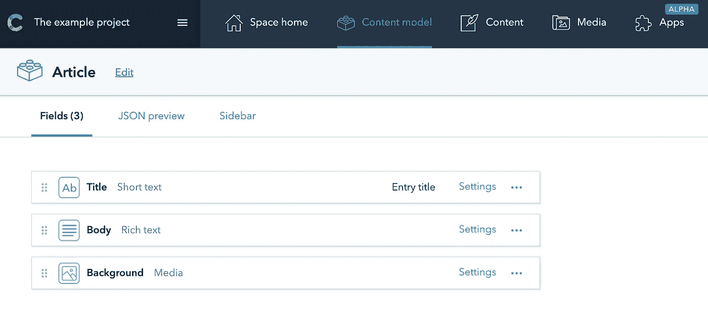
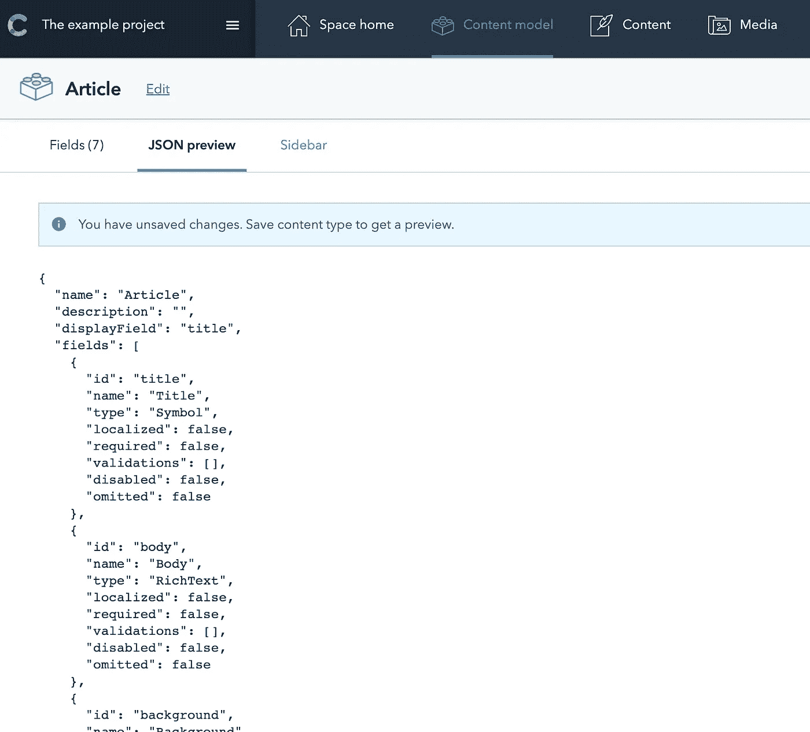
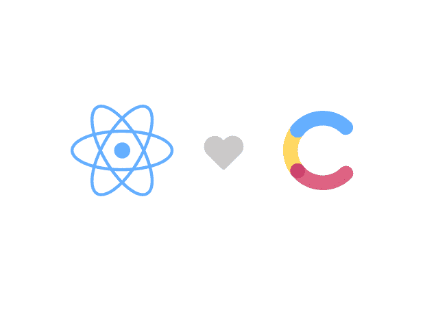

# 使用 React 和 Contentful 构建 SPA

> 原文：<https://medium.com/swlh/building-spa-using-react-js-and-contentful-ea3596cbdfba>


SPA with React & Contentful

各位同事好。我关于网络编程的博客从今天开始。我希望这将是有用的和翔实的给你。那么，我们开始吧。

现代服务是如何处理内容的。对我这个开发者来说，Contentful 是单页面应用程序的最佳 CMS 解决方案。我想告诉大家内容基础设施是如何提升传统内容管理系统的限制的，以及为什么你应该在你的项目中与 **React** 一起使用它。

## 知足常乐的主旨

Contentful 是 CMS 解决方案，它使我们能够避免使用 SQL 数据库，连接到一个网站和托管在一些可怕的服务器上。它的管理仪表板是用户友好的，伟大的 API 比其他 CMS 解决方案如 Wordpress 要快得多。

我们的目标是将应用程序内容分成不同的模型，然后基于这些模型创建内容。在 Contentful 客户端的帮助下，我们可以获取 JSON 格式的内容，然后将其呈现为**反应。组件**。所以不要浪费时间，让我们练习吧！

## 令人满意的仪表板

首先你应该在 [*创建账户*](https://app.contentful.com) *。*一开始就有一个测试项目给你。但是我们将创建我们自己的内容模型。



Content Model **Article**

在上图中，我创建了一个新的内容模型 **Article** 和字段类型*短文本*、*富文本*、文本和*媒体。*

目前，Contentful 支持以下类型的字段:

*   **短文本** —最多 255 个字符。将其用于标题、姓名、标签、URL 和电子邮件地址
*   **富文本** —最多 50k 个字符。用于描述、文本段落、文章。它可以用标记编辑。例如，您可以使用粗体或斜体字体
*   **数字** —整数或小数
*   **日期** —具有不同时间格式(仅日期，带时区或不带时区)和时间模式(AP/PM，24 小时制)的日期字段
*   **位置** —位置坐标
*   **媒体** —支持几乎所有类型文件(图像、视频、PDF、docx、代码、档案等)的领域。)
*   **布尔型**——由真/假值及其标签组成
*   **JSON 对象**—JSON 格式的任何数据
*   **引用** —链接到另一个内容模型

这些字段涵盖了 SPA 中开发人员的需求。模型完成后，我们得到了一个 JSON 格式的预览，它将由 Contentful 客户端获取。



Article model JSON view

下一步是从 Contentful 获取数据。对于这个任务，我们应该安装 [*内容丰富的客户端*](https://www.npmjs.com/package/contentful) 。

```
npm install --save contentful
```

下一步是使用设置中的*访问令牌*和*空间 id* 初始化客户端。

```
// Contentful Client exampleimport { createClient } **from** "contentful";export default class ContentfulClient {
  getClient = async () => {
    const client = await createClient({
    space: CONTENTFUL_SPACE,
    accessToken: CONTENTFUL_TOKEN,
  });
  return client;
};
```

这些数据是私有的，所以我不建议用代码来存储它(例如你可以使用*)。env* 文件)。Contentful 提供了令人敬畏的 [*交付 API*](https://www.contentful.com/developers/docs/references/content-delivery-api/#/introduction) ，但是在示例项目中，我将通过内容 id 获取数据。您可以直接在这些内容的页面中的**信息部分找到内容 id。**

```
// Add method to ContentfulClient class
// getEntry method fetches data by content IdgetEntry = async id => {
  const client = await this.getClient();
  const entry = await client.getEntry(id, { include: 10 });
  return entry;
};
```

现在我们已经准备好为我们的应用程序获取内容丰富的数据，但在此之前，我们需要根据**文章**内容模型创建新的内容。


Content based on **Article** model.

该内容的一大优点是，我们可以在这里存储所有媒体文件。只需转到标签**媒体**并上传您的文件。

我们收到了 API 的回复。太酷了。但是我们对于富文本字段有一个问题:

```
"body": {
  "data": {},
  "content": [
    {
       "data": {},
       "content": [
         {
           "data": {},
           "marks": [],
           "value": "This content is using ",
           "nodeType": "text"
         },
         {
           "data": {},
           "marks": [
             {
               "type": "bold"
             }
          ],
            "value": "Article",
            "nodeType": "text"
          },
          {
            "data": {},
            "marks": [],
            "value": " Content model.",
            "nodeType": "text"
           }
         ],
         "nodeType": "paragraph"
       },
       {
         "data": {},
         "content": [
       {
         "data": {},
         "content": [
           {
             "data": {},
             "marks": [],
             "value": "I was working ...",
             "nodeType": "text"
           }
         ],
           "nodeType": "paragraph"
       },
       {
         "data": {},
         "content": [
           {
             "data": {},
             "marks": [],
             "value": "Sascha KonietzkeCo-Founder & CEO",
             "nodeType": "text"
           }
         ],
         "nodeType": "paragraph"
       }
     ],
    "nodeType": "blockquote"
   },
   {
     "data": {},
     "content": [
   {
     "data": {},
     "marks": [],
     "value": "",
     "nodeType": "text"
   }
 ],
 "nodeType": "paragraph"
  }
 ],
  "nodeType": "document"
}
```

我看到的第一个问题是:“*嗯，有什么机会可以渲染这个…？”。*而我们这里有一个解决方案[](https://www.google.com/search?q=%40contentful%2Frich-text-react-renderer&oq=%40contentful%2Frich-text-react-renderer&aqs=chrome..69i57j69i58.404j0j7&sourceid=chrome&ie=UTF-8)**。***Rich-text-react-renderer**是 Contentful developers 开发的一个库，用于将富文本字段渲染到 React 组件中。*

```
*npm install --save @contentful/rich-text-react-renderer*
```

*让我们基于模型**文章为所有内容实现 React 组件文章！***

```
*import React from 'react';
import PropTypes from 'prop-types';
import { BLOCKS, MARKS } from '@contentful/rich-text-types';
import { documentToReactComponents } from '@contentful/rich-text-react-renderer';
import './article.css';const Article = ({
    document: {
      fields: {
        body,
        background,
        title
      }
    }
  }) => {
  const options = {
    renderNode: {
      [BLOCKS.PARAGRAPH]: (node, children) => children,        
      [BLOCKS.QUOTE]: (node, children) => (
        <div className="quotation">{children}</div>
     ),
      [MARKS.BOLD]: (node, children) => (
        <span className="bold-title">{children}</span>
     ),
   },
  }; const article = documentToReactComponents(
    body,
    options,
  ); return (
    <div
      className="article-wrapper"
      style={{ backgroundImage: `url(${background &&                         
        background.fields.file.url})` }}
    >
      <div className="rich-text-content">
        <h1>{title}</h1>
        {article}
      </div>
    </div>
  );
};export default Article;*
```

**文档*对象是我们从 Contentful API 得到的内容。它存储了我们在内容模型中描述过所有字段。*

*现在我们已经有了一个用于**文章**模型的通用解析器。但是，如果您向富文本字段添加任何其他类型的标记(例如下划线)，您将需要在**documentToReactComponents**选项对象中描述这种标记的解析规则。*

*这是一个关于如何使用 Contentful 和 **React 的简短课程。**项目代码在 [*github*](https://github.com/ArteezyCode/ContentfulExample) 上。我希望这些信息是有用的，并感谢您在 Medium 和 github 上的支持！*

*我很乐意回答你所有的问题和评论。🤘*

**