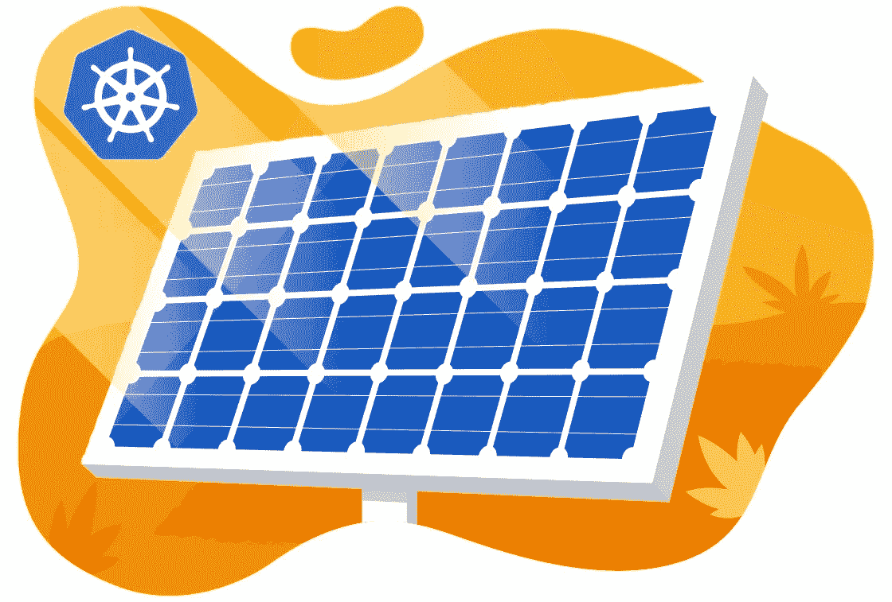
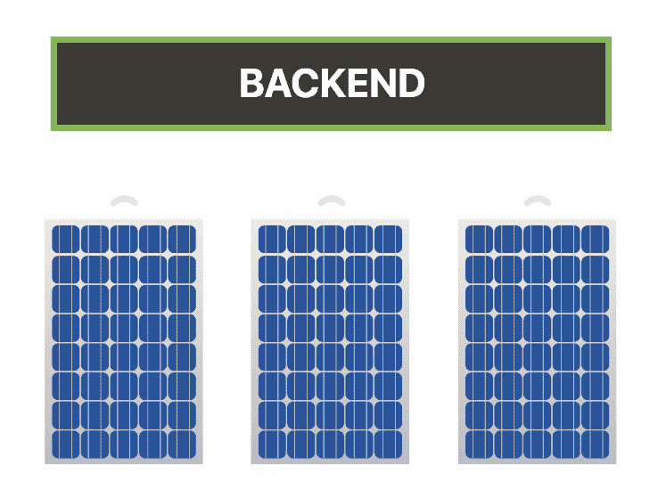
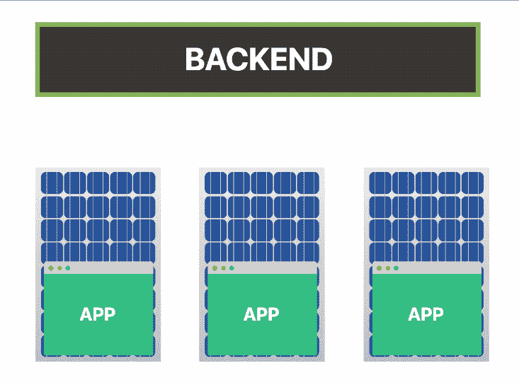
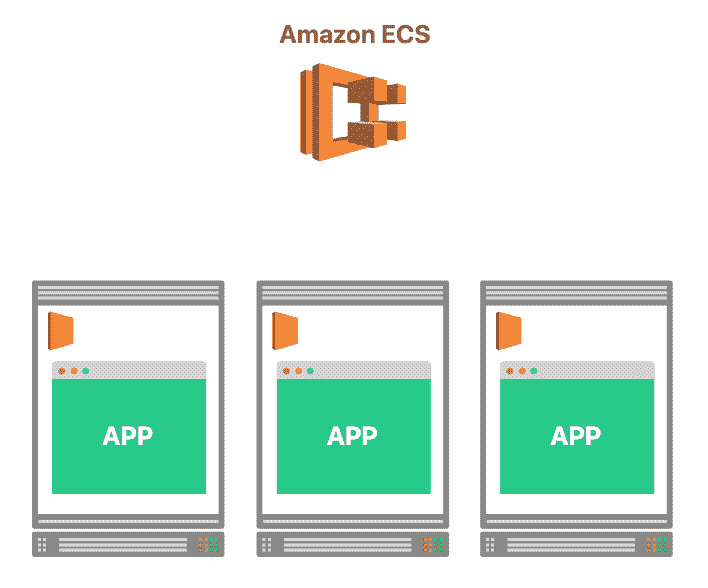
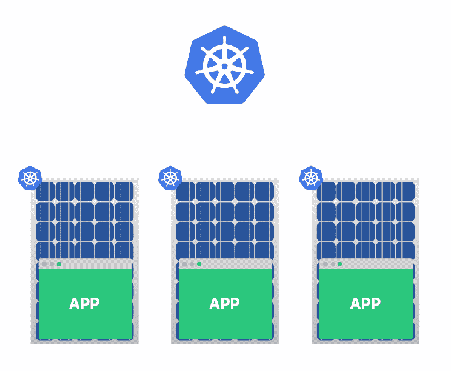
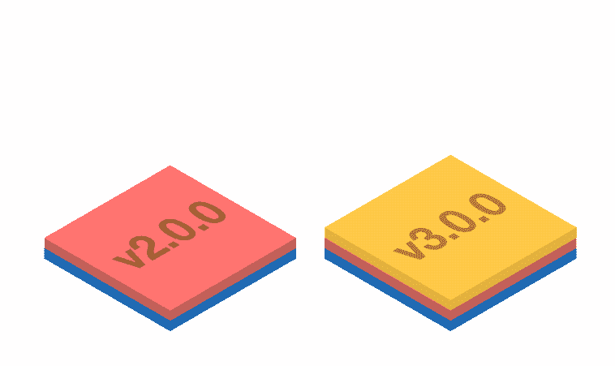
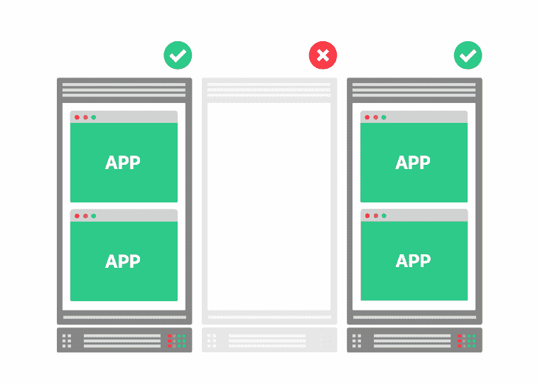
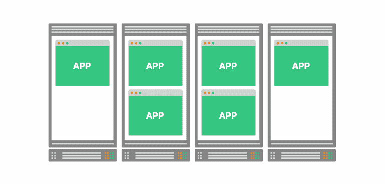
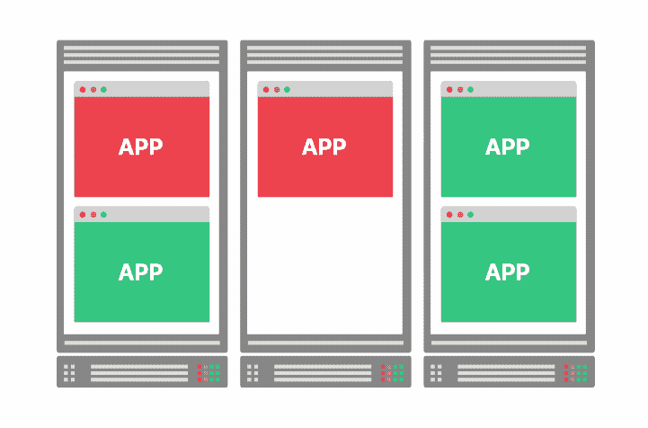
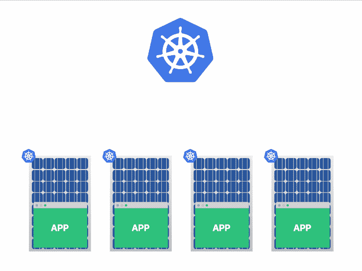

# 用云技术建造未来的太阳能发电厂

> 原文：<https://medium.com/swlh/building-the-solar-plant-of-the-future-with-cloud-technologies-66be12adcb3c>

在过去十年中，对可再生能源的需求一直在稳步增长，太阳能发电超过了所有其他可再生发电形式的增长。

太阳能电池板越来越便宜，并在世界许多地方成为经济上可行的可再生能源。

除了企业和政府，越来越多的个人发现安装太阳能电池阵列在小范围内是可行的。

然而，从太阳能电池板获取最佳能量是一件棘手的事情。

为了让太阳能电池板高效运行，它们需要保持清洁，并与太阳保持最佳角度，以平衡发电和防止过热。

*那么，当事情不对劲，需要你注意时，你如何让一切都在掌控之中，并得到通知呢？*

# 软件正在吞噬世界

一种解决方案是利用小型嵌入式设备

*   测量电池的性能和效率
*   监控环境
*   驱动致动器在白天跟踪太阳

嵌入式计算机收集数据并将其发送到一个中心位置，然后在那里进行汇总、处理和存储。

如果太阳能电池板的效率下降，可以提醒操作员采取行动。

在更大的工厂中，太阳能电池阵列的数据通过有线网络传输，但看到这些嵌入式计算机无线连接并不罕见。

**想象一下将你的太阳能电池板控制在 5G 以上:**无需处理额外电缆的美妙之处，以及长时间响应、掉线和超时的可怕之处。

在这样的设置中，部署和管理应用程序是一个真正的挑战。

# 大规模设计物联网

如果您正在管理数百或数千台设备，亲自去每台设备安装软件和固件更新是不现实的。

你应该设计一个可以远程更新的系统。

理想情况下，您应该设计一种机制来打包软件，在不牺牲可移植性的情况下，开销几乎为零。

小而有效的东西。

它将持续数年，并安全地传输数据，以防止恶意行为者破坏您的基础架构。

**通信应该处处加密。**

*但是如何？*

设计一个安全的集群并不是一件容易的事，特别是在一个太阳能装置上，它可以跨越很大的区域，很难保护周边免受入侵者的攻击，这些入侵者可以通过物理方式访问您的设备来获取机密。

*您如何防范这种情况？*

即使你已经解决了安全问题，并推出了软件和固件更新策略，你还有很长的路要走。

您仍然需要创建一个服务来聚合和处理数据，设计一个可视化的仪表板，设置警报和监控，以及一个控制平面来推动协调的变化。

起初看似有趣的周末项目变成了分布式系统工程中的主要工作。

存在专门为太阳能发电厂设计和安装软件的公司。该不该投降买预包装软件？

从来没有。

那么，你如何才能与一家拥有多年经验的老牌企业竞争呢？

**靠耍小聪明。**

# 使用云基础架构扩展集群

构建大规模的物联网，比如太阳能发电厂的规模，与构建云基础设施有很多共同点。

Amazon Web Services 的产品弹性容器服务(ECS)可以跨几个服务器部署应用程序。

它被设计为在工作计算机上安装一个代理，该代理与负责调度工作负载的主节点通信。

您告诉 ECS 要部署什么，主节点上的软件指示其中一个代理下载并运行它。

这听起来很像你想用太阳能电池板做的事情。

您希望在每台嵌入式计算机上安装代理，并且希望从中央位置管理应用程序。

但是 ECS 是亚马逊才有的，你在硬件上是占不到便宜的。

你需要的是 ECS 的开源版本。

**进入 Kubernetes。**

# kubernetes——容器编制者

Kubernetes 类似于 ECS:您在设备上安装一个名为 kubelet 的代理，它与 Kubernetes 主服务器通信，形成一个集群。

从那时起，您的设备就像一个整体，您可以安排部署和管理应用程序。

然而，这一次，你没有被锁定。

Kubernetes 是一个主要的开源项目，你可以免费下载、定制和贡献。

*安全吗？*

kubelet 和主节点之间的通信使用 TLS 进行保护。

每个节点都可以配置自己的证书，因此即使一个节点受损，您也可以只拒绝一个证书，同时保持群集的其余节点可用。

更好的是，该社区有大量关于如何保护您的集群的良好实践的共享资源，这些资源是从数千个真实的 Kubernetes 部署中收集的。

你应该看看这些 kubernetes 安全最佳实践的集合，明白我的意思。

*现在，如果它有办法推出更新就好了……*

Kubernetes 不知道如何部署用 C、Java 或 Node.js 编写的应用程序。

事实上，它根本不知道如何部署应用程序。

那没用，是吗？

Kubernetes 只能部署 Linux 容器——这也是它被称为“容器协调器”的原因。

**容器本质上是档案——类似于 zip 文件。**

要运行容器，您需要解包归档文件，并在主机上将应用程序作为一个进程运行。

您可能不希望进程相互干扰，所以 Linux 容器有一个很好的特性，即每个进程都是相互隔离的。

因此，除了开发分发应用程序的机制，您还可以:

1.  请 Kubernetes 安排一次部署
2.  等待每个节点上的代理(kubelet)来接收任务
3.  让 kubelet 下载存档文件，并作为一个独立的进程运行它。

**集装箱也被设计成高效的。**

当您更新您的包裹并希望重新分发它时，您只能运送先前和当前集装箱之间的差额。

当收到增量时，新的包从 diff 重新计算，解压缩并作为一个单独的进程运行。

Linux 容器和 Kubernetes 是在你的物联网上运行应用程序的优秀平台。

事实上，在太阳能发电厂安装 Kubernetes 可以让您受益于:

*   发布部署的集中调度程序
*   作为容器交付的安全和加密的更新
*   一项成熟的技术，能够扩展到数千台设备

那么，当太阳能电池板破裂时会发生什么呢？

# Kubernetes 中的弹性和故障转移

Kubernetes 会持续监视您的基础设施，寻找失败的流程和代理。

当一台设备出现故障时，Kubernetes 会将该计算机上部署的所有应用程序重新安排到另一台计算机上。

如果其中一个应用程序失败，可能是因为内存泄漏，Kubernetes 将重新启动应用程序预定的次数。

Kubernetes 的设计是基于这样一种理解，即不能期望节点永远继续工作，所以有一个自我修复的设计；它总是观察基础架构的当前状态，并在检测到与基础架构的期望状态不匹配时采取措施。

例如，如果它发现差异，如果没有足够的容量来运行所有的应用程序，它会要求云提供商提供更多的计算资源。

Kubernetes 非常适合以最大化基础设施效率的方式部署容器。

当您部署一个应用程序的三个实例时，这些实例被安排来最大化效率。

不能保证您的应用程序的三个实例最终会出现在五个不同的设备上。

它们可以全部部署在同一个节点上，也可以跨两个节点部署，这取决于可用的物理资源。

特别是在资源稀缺的嵌入式领域，您不希望将部署放在任何地方。

**您希望有一套严格的部署规则。**

例如，每个太阳能电池板在任何给定的时间都应该只有一个应用程序在运行。

在应用程序负责倾斜太阳能电池板以跟踪太阳轨迹的情况下，您不希望将两个应用程序部署在试图驱动同一台电机的同一个节点上。

# Kubernetes 中的高级部署

Kubernetes 可以使用几种策略来为节点分配容器。

最直截了当的策略是部署*。*

*在*部署*中，您指定应用程序的实例数量，Kubernetes 将找到空间来分配它们。*

*这是最常见的部署类型，但是虽然它对于云部署很有用，在云部署中，您不需要关心哪个特定的节点正在运行我们的应用程序(您只需要关心它是由什么东西运行的)，但是在嵌入式环境中，它就没那么有用了。*

*其他策略包括[*statefullset*](https://kubernetes.io/docs/concepts/workloads/controllers/statefulset/)和 [*ReplicaSet*](https://kubernetes.io/docs/concepts/workloads/controllers/replicaset/) 。*

*它们中的每一个都有不同的权衡，但并不符合我们让应用程序在每个可用节点上运行的目标。*

*为此，您需要一个 [*DaemonSet*](https://kubernetes.io/docs/concepts/workloads/controllers/daemonset/) ，一个在每个节点上部署一个应用程序的策略。*

*如果您向集群添加新的物联网太阳能电池板，Kubernetes 也会自动在该嵌入式设备(节点)上调度和部署应用程序。*

**

*到目前为止一切顺利。*

*你有:*

*   *打包成 Linux 容器的应用程序*
*   *一种安全、增量分发软件的集中方式*
*   *在所有设备上部署应用的策略(对硬件访问进行优先排序)，或在尽可能少的设备上部署应用的策略(最大化效率)*
*   *出现故障时能够自我修复的可靠平台*

*考虑到你是白手起家，你现在的处境相当不错。*

*现在您已经知道 Kubernetes 的能力以及它如何扩展您的物联网，下一步是什么？*

> ****不要错过接下来的故事、实验或提示。如果你喜欢这篇文章，请继续关注。将新内容直接发送到您的收件箱，并提高您在 Kubernetes 中的专业水平。* [*现在就订阅*](https://learnk8s.io/newsletter)***

# *在车里跑 Kubernetes*

*2018 年 6 月，Redmonk 写了一篇文章，建议[丰田在其汽车中运行 Kubernetes](https://redmonk.com/jgovernor/2018/06/28/rancher-labs-treating-cattle-like-cattle/)。*

*你可以想象你汽车上的每一个小部件，如仪表板、收音机功能或侧灯，都装有装有 Kubernetes 代理的计算机。*

*这些组件相互连接，可以使用内部网络进行通信。*

*kubernetes 主服务器负责确保服务始终启动和运行，以及调度部署。*

**需要更换仪表板吗？**

*只需更换组件，Kubernetes 就会安排软件在嵌入式计算机上运行。*

**添加 GPS？**

*没问题。*

*将设备加入集群，并开始传输数据。*

*起初，这听起来可能有些奇怪。*

*但仔细想想，也有道理。*

*您必须连接这些组件并协调它们。*

*你不能让前灯从仪表板上断开。*

*但事实证明这是不对的。*

*丰田没有在他们的汽车上运行 Kubernetes，但他们将 Kubernetes 作为其后端服务的一部分。*

*一旦你将汽车连接到他们的诊断工具之一，数据就会从车辆中提取出来，并被吸收到一个旨在运行在云中的 Kubernetes 集群中。*

*文章发表几天后，Redmonk 修改了文章以澄清这一点。*

*即使这个故事是不真实的，只是一个误解的结果，它仍然会让你思考。*

**如果呢？**

# *如果你能在车里运行 Kubernetes 会怎么样？*

**是什么阻止你在太阳能发电厂使用 Kubernetes？**

**还是在其他任何物联网设备中？**

*您可以解决一些困难的挑战，如保护通信、提供增量更新和集中控制您的车队。*

*你可能有最好的时机来推销你的物联网。*

*节省了数百天的开发时间，因为您可以重用成熟的工具。*

*虽然 kubernetes 最初被设计为在数据中心运行，但它的应用远远超出了云，而且用不了多久，Kubernetes 就会在另一个物联网设置中使用。*

*我迫不及待地想知道你下一步会用它做什么。*

# *那都是乡亲们！*

*感谢[阿莱德·詹姆斯](https://www.linkedin.com/in/aledjames/)(布里斯托尔大学)和[乔·海克](https://twitter.com/heckj)的反馈！*

*如果您喜欢这篇文章，您可能会发现下面的文章很有趣:*

*   *[什么是 Kubernetes？优化您的托管成本和效率](https://learnk8s.io/blog/what-is-kubernetes),了解 Kubernetes 的工作原理以及最初发明它的原因*
*   *[Kubernetes 混沌工程:经验教训——第 1 部分](https://learnk8s.io/blog/kubernetes-chaos-engineering-lessons-learned)当 Kubernetes 出现问题时会发生什么？Kubernetes 能从失败中恢复并自愈吗？*

# *成为 Kubernetes 中部署和扩展应用程序的专家*

*你在建太阳能工厂吗？也许是辆车？还是只想大规模部署 web 应用程序？*

*从我们的实践课程开始，学习如何掌握 Kubernetes。*

*了解如何:*

*   *轻松处理最繁忙的流量网站*
*   *将您的作业扩展到数千台服务器，并将等待时间从几天缩短到几分钟*
*   *了解您的应用在多云设置下高度可用，让您高枕无忧*
*   *通过仅使用您需要的资源，在您的云账单上节省大量现金*
*   *增强您的交付渠道，全天候部署应用程序*

*[**成为专家→**](https://learnk8s.io/training)*

*P.S .不要错过下一个实验，洞察，或者*优惠* : [订阅邮件列表！](https://learnk8s.io/newsletter)*

**最初发布于*[*learn k8s . io*](https://learnk8s.io/blog/kubernetes-on-solar-plants)*

**

## *这篇文章发表在 [The Startup](https://medium.com/swlh) 上，这是 Medium 最大的创业刊物，拥有+406，714 名读者。*

## *在这里订阅接收[我们的头条新闻](http://growthsupply.com/the-startup-newsletter/)。*

**