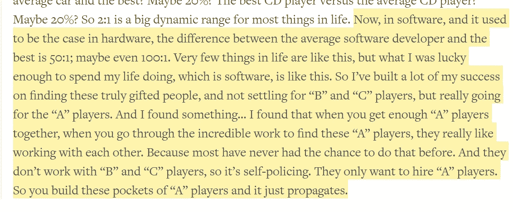

# 与自由开发者一起建立自己的网站

> 原文：<https://medium.com/swlh/building-your-own-website-with-freelance-developers-4caca6486dd1>

Photo by [Lee Campbell](https://unsplash.com/@leecampbell?utm_source=medium&utm_medium=referral) on [Unsplash](https://unsplash.com?utm_source=medium&utm_medium=referral)

## 如何为工作雇用合适的人

建立自己的网站不是一件容易的工作。当然，你可以走一条艰难的路，学习一些 [web 开发基础知识](https://blog.soshace.com/en/2019/03/04/web-software-development-fundamentals/)或者选择一门课程，学习一门编程语言，但这肯定会花费更多的时间，而且很可能是金钱——这两种最稀缺的资源你最好分配到其他地方。没有人会比专业人士做得更好。然而，也有一些陷阱需要避免，重要的是要知道在职业自由职业者身上应该寻找什么。事不宜迟，让我们开始解决这两个重要问题。

# 哪里可以找到专业的自由网络开发者

有专门的自由职业者市场、招聘平台或全周期开发公司，在那里你可以选择一个开发人员或一组自由职业者来为你的项目工作。让我们进一步分析一下。

# 自由职业市场

from depositphotos.com

自由职业平台最明显和最受欢迎的版本是 [Upwork](https://www.upwork.com/) 、[自由职业者](https://www.freelancer.com/)和 [Fiverr](https://www.fiverr.com/) 。这些网站大多像网上拍卖一样，最便宜、最快的投标会胜出，这意味着你不一定会找到适合这份工作的人。对于上面提到的，最专业的网站被认为是 Upwork。在 Upwork 上，你发布一份免费的工作，从竞标的自由职业者那里获得合格的提议，为这份工作选择最佳候选人，就所需的付款时间表达成一致(固定价格或基于小时的)，然后看看这对你来说效果如何。在这个过程中有一定的风险，因为你实际上是自己选择一个自由职业者，并在分配项目之前评估他们的知识。此外，如果你不知道如何检查已经完成的程序员的工作，那些表面上看起来很好的工作，在未来可能意味着毁灭性的结果。此外，如果你没有在早期发现问题，并且已经付钱给你的自由职业者，你的开发者可能会永远离开，给你留下一个半功能的网站。

# 预先审查的招聘平台

from depositphotos.com

在预先审查的招聘平台上，你发布一个职位，其成本因平台而异，并接收一批合格的预先审查(测试和评估)的专业人员，选择一名开发人员，在试用期内看看他是如何工作的，然后要么改变候选人，要么继续与已经选择的人合作。尽管这个选项看起来比前面讨论的要贵，但事实上，你可能最终会省钱:首先，你很可能会有一个试用期，在此期间你可以看到开发人员如何处理一个项目并与你沟通；第二，开发人员会完全投入到你的项目中，不会同时处理多个项目；第三，你很有可能会回来，并让一个机构对你的开发商的任何错误行为负责，如果没有，那么至少你可以期待最少的支持和/或补偿，而没有开发商完全消失。那些通过预审的平台中有 [TopTal](https://www.toptal.com/) 、 [Crossover](https://www.crossover.com/) 、 [Soshace](https://soshace.com/for-clients) 、 [Gun.io](https://www.gun.io/) 等。

# 专业自由网站开发者应该具备什么样的素质

在选择开发人员时，您需要注意一些事情，以及一些您最好避免的陷阱。

# 要寻找的东西

from depositphotos.com

一个有能力建立网站的优秀开发人员的技能必须包括 HTML、CSS 和 JavaScript 的知识，一组核心库，如 CSS 的 BootStrap 和 JavaScript 的 jQuery，精通其中一个框架，如 React、Angular 或 Vue.js，以及一些后端知识(Python、Ruby、PHP)。例如，如果你正在建立一个电子商务网站，你将需要一个 PHP 程序员，如果你正在开发一个交互式 web 应用程序，那么 JavaScript 和 Node.js 程序员是你最好的朋友。

# 要避免的事情

from depositphotos.com

如果你在没有招聘经理帮助的情况下开始自己寻找开发人员的旅程，那么远离那些拒绝做测试任务或编码挑战的高薪自由职业者，因为这可能看起来像一个危险信号。然而，最好也不要在开发工作上吝啬，因为如果工作马虎，那么你最终会为修改别人的代码付出更多。

此外，如果你还没有想到一个计划或没有一个具体的想法，你的网站必须看起来像什么，那么现在是时候你想一个计划，模型，准备详细的信息，你有什么想法，你试图用你的网站完成。设置里程碑，检查开发人员跨越这些垫脚石的进度。准备投资一些法律文书工作，以确保你有一个可行的工作合同。

That’s an actual quote from Steve Jobs as seen at [Farnam Street](https://fs.blog/2019/04/a-players/).

# 结论

雇用自由职业者并不容易，但完全可行的任务。无论你选择什么平台或服务，对你要完成的目标有一个清晰的愿景，一个可行的计划，一个坚定的决定，投入你的金钱和时间去寻找最适合这份工作的人，总是好的。

## 这篇文章发表在 [The Startup](https://medium.com/swlh) 上，这是 Medium 最大的创业刊物，拥有+445，678 名读者。

## 订阅接收[我们的头条](https://growthsupply.com/the-startup-newsletter/)。

