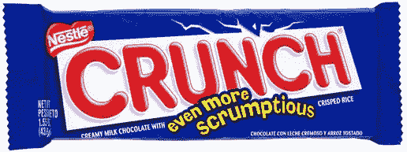

# Scrum 中的倦怠以及我们如何处理它

> 原文：<https://medium.com/swlh/burnout-in-scrum-6e0edcf85168>

Photo by [Cristian Escobar](https://unsplash.com/@cristian1?utm_source=unsplash&utm_medium=referral&utm_content=creditCopyText)

# 开始

> “我给你带来了巨大的喜悦”

起初被吹捧为万灵药的 Scrum 已经迅速成为软件开发中操作的[*事实上的*标准](/@aevitas/the-tax-you-are-paying-for-using-scrum-50f12298b422)，无论是行业还是垂直领域。

事实证明，运行纯 Scrum 真的很难。

由于许多领导者努力推动某种形式的实现，公司最终得到了一些低劣的 Scrum 变种。敏捷教练可能会笑着暂时忍受，也许这是迈向理想的第一步。也许下一次冲刺应该会有另一次进化迭代。这就是回顾的目的，不是吗？

不是吗？

> “退让一步，他们会退让一步”

所以我们在路上踢改变的桶。但是截止日期不会改变。而第一次尝试现在是我们不变的现实。管理层会高举我们迄今为止构建的 Scrum 模型，并自豪地欢呼这是我们进行 Scrum 的方式。

也许它不完全是。尽管如此，当皇帝给你发工资的时候，你很难去批评他的新装。

> “我的杯子是半满的”

让我们假设我们做了一个伟大的第一次尝试，它实际上是相当接近理想的。这种模式行得通。是的，每一次冲刺都会增强我们的信心。

那么为什么感觉重复呢？

我们改变回顾，引入一些乐趣。但这并没有让我们摆脱那种我们永远处于某种常规中的琐碎感觉。

# 假设

> “示威游行”

我认为 Scrum 的本质和软件开发中交付的压力有助于实际实现*受控的紧缩*。

Tastes so good, but boy will you pay for it later

嘎吱嘎吱是地方病。当然是在[游戏开发](https://kotaku.com/crunch-time-why-game-developers-work-such-insane-hours-1704744577)里。因此，虽然它在短期内给我们带来了结果，但我们不能依赖这样的方法来进行可持续的练习。

> 有时治愈，经常治疗，永远安慰

根本原因显然是 Scrum 的不完美应用，以及对一个或多个敏捷原则的违反。

但是我对此没有解决办法。对于 Scrum 在任何一个组织中扎根的失败，有太多的排列和考虑。

相反，就像一个治疗症状的医生一样，我提出以下猜想:让你的团队多样化。

具体来说，**跨开发和生产支持部门轮换团队**。

# 轶事

我在一家公司工作，我们从精益过渡到 Scrum。由于敏捷基础雄厚，转型迅速，很快见效。在 sprints 中，我们建立了一个预测的节奏，发现所有 6 个开发团队都不可思议地坚持了计划的速度并提高了士气。

事实证明，这种情况不会持续很久。

在 3 个月内，我们开始看到我们的开发人员精疲力竭。Scrum 在新功能开发方面表现惊人，通过结合我们精益时代有限范围的经验，我们经常推向生产。

这些压力在持续交付、Kubernetes 和不可变基础设施出现之前就存在了。结果是开发人员和开发人员分担了沉重的责任。我们的功能团队实时支持产品的推出，如果需要一个或六个小时，那么整个团队都在待命，一遍又一遍地检查。

# 创可贴解决方案

作为高级技术团队的一员，我们注意到了后果并重新评估了我们的方法，同时牢记产品的提交日期。

我们提出的解决方案很简单:

> 1)生产支持将实施看板
> 
> 2)功能开发将继续使用 Scrum
> 
> 3)每个 sprint，一个特性开发团队接管生产支持

所以在任何时候，都有 5 个团队在做特性开发，1 个团队在做产品支持(PS)。每个冲刺阶段(一周)，我们轮换一个团队做 PS。

在 3 次冲刺中，我们收到了来自轮换团队的反馈。PS 并不是每个人都喜欢的活动，但它确实让团队松了一口气。看板中没有交付的截止日期，只有优先级和群集，后者实际上是更深入、更基本的解决方案，而不是拼凑的补丁。

我们让实验进行了 3 个月。然后它作为练习坚持下来。

在我任期的剩余时间里，这种模式运行良好。

回想起来，我不会说看板解决了 Scrum，或者相反。相反，我认为从一个过程到另一个过程的改变，打破了单调乏味的日常工作。因此，虽然我将这种方法作为您的组织的家庭补救措施，但我并不期望它是万灵药。

毕竟没有灵丹妙药。