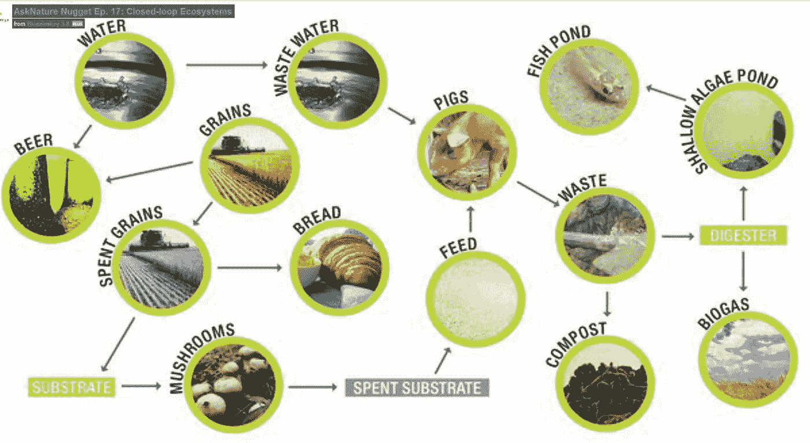

# 商业模式:从线性到循环再到再生

> 原文：<https://medium.com/swlh/business-models-from-linear-to-circular-to-regenerative-9f10c19f337>

Regenerative Business Model of a Beer Brewery, source: [https://vimeo.com/channels/asknaturenuggets](https://vimeo.com/channels/asknaturenuggets)

我在荷兰的正规公司工作了 25 年多，担任营销和业务部门经理，我从来不知道我现在要告诉你什么。但幸运的是，世界正在改变，我们正在各个方面进行创新。

不仅仅是科技受到自然的启发，驱动我们经济的商业模式也是如此。让我陈述一些来自…的事实