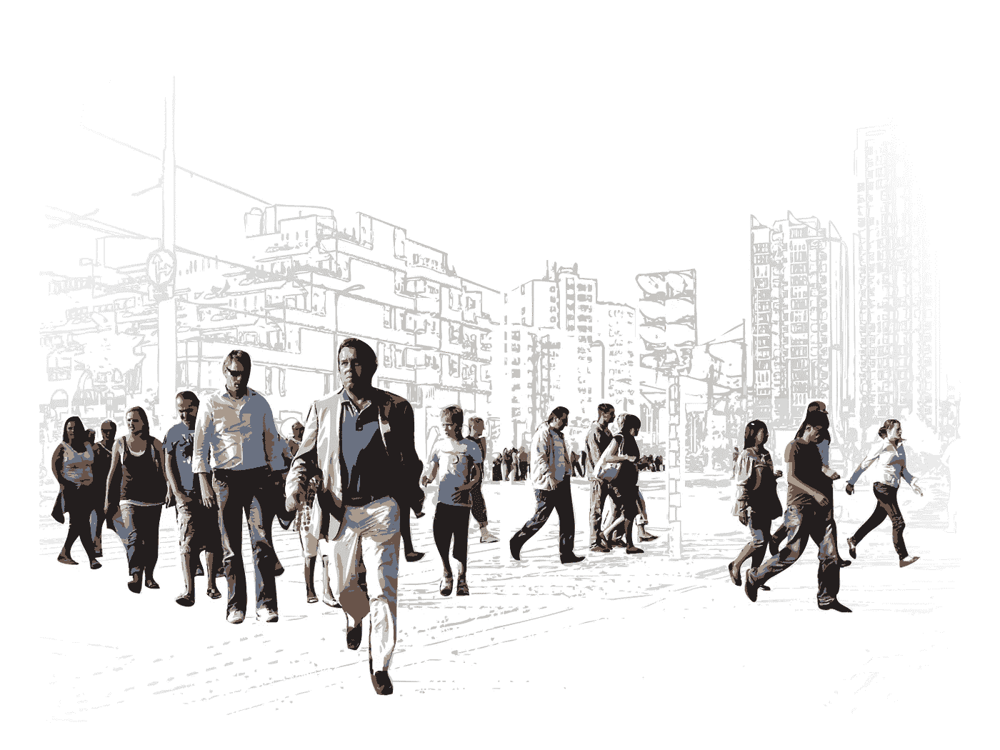

# 领导人繁忙的排毒计划

> 原文：<https://medium.com/swlh/busy-detox-for-leaders-47ddbd118e53>

## 如何在你的时间里收回权力？

作为经理，你没有足够的时间。你的收件箱感觉像胡佛大坝决堤了。你似乎无法摆脱那些想要你付出更多时间的人的关注。

事实上，让每一分钟都充满待办事项会适得其反。你也需要留出时间让[休息](https://www.linkedin.com/pulse/all-ways-lack-sleep-makes-you-terrible-work-isabelle-roughol/)