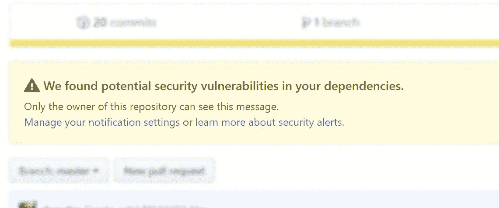

# 但这只是一个开发依赖…

> 原文：<https://medium.com/swlh/but-its-just-a-dev-dependency-566646ebeec9>

Github security alert

**TL；安全警报很容易淹没在洪水中，尤其是当它们来自开发依赖时。虽然 dev dep 在实践中可能不会经常受到给定漏洞的影响，但警报的存在会威胁到您代码的其余部分。因此，您应该像对待生产依赖关系一样对待开发部门。**