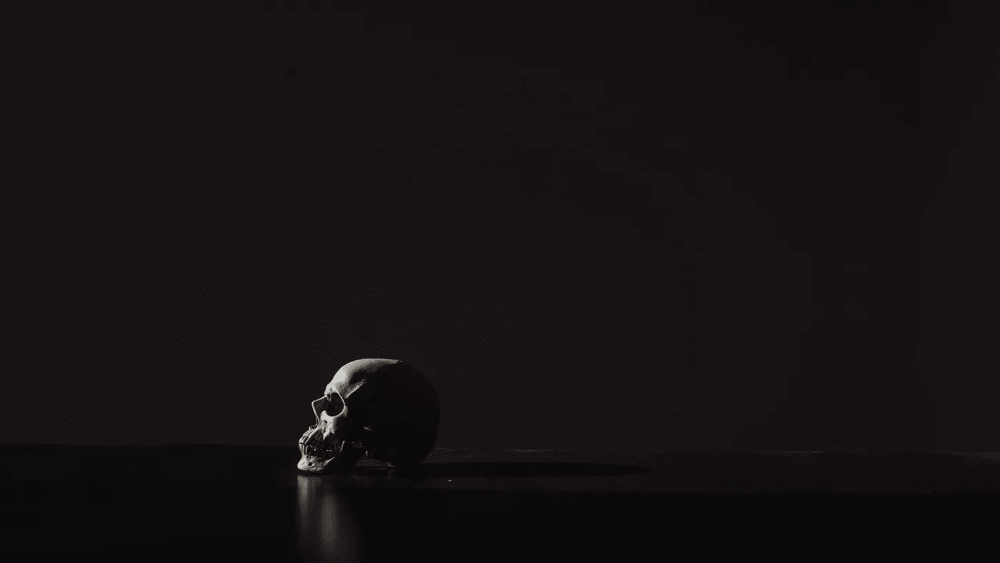

# 但是他们说在线是永恒的

> 原文：<https://medium.com/swlh/but-they-said-that-online-was-forever-6e0402ef0abb>

未来的几代人可能会知道你是数字黑暗时代的无名公民

Photo by [Mathew MacQuarrie](https://unsplash.com/photos/KFdIgwm8HTs?utm_source=unsplash&utm_medium=referral&utm_content=creditCopyText) on [Unsplash](https://unsplash.com/search/photos/death?utm_source=unsplash&utm_medium=referral&utm_content=creditCopyText)

每次我遇到一具尸体，我都知道它就要发生了，我本可以选择退出。在死亡得到高度管理的地方，病人和死者的护理主要由专业人员进行，这就是选择和控制的奢侈。我来自一个国家，在那里[打开棺材是很常见的](http://thefuneralsource.org/trad01.html)，所以…