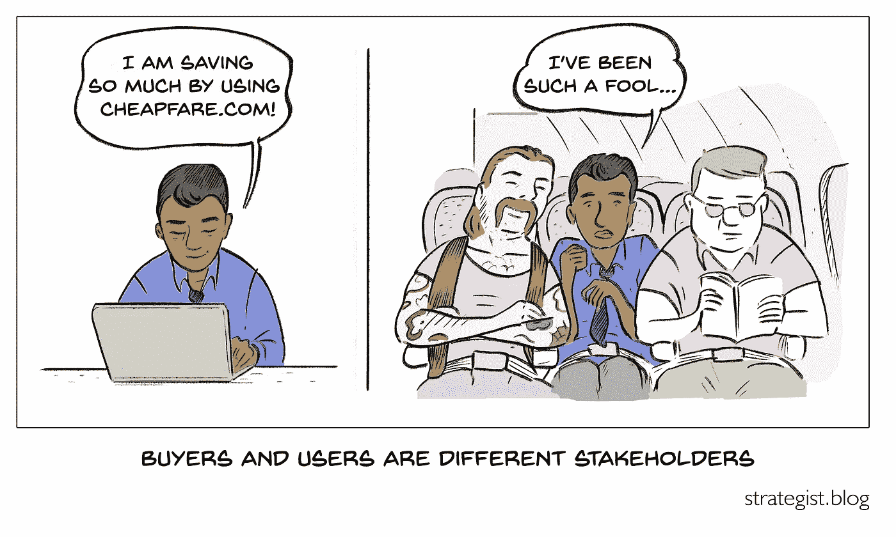

# 买家不是用户

> 原文：<https://medium.com/swlh/buyers-are-not-users-39cff82631cc>

大约 18 个月前，我和我的同事开始了我们最近的创业。我们非常了解我们的“买家”,因为我们在医院为护士长服务了很多年。我们发现并向他们推荐了一款产品，我们认为该产品可以解决他们最迫切的需求之一，即吸引和留住他们的临床工作人员。

我们也知道我们的“用户”:那些医院的护士经理。我们知道护士经理已经…