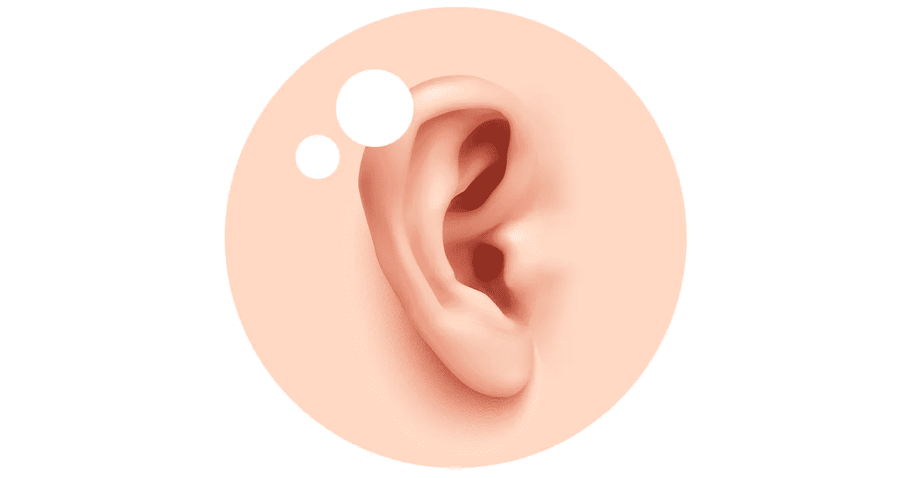

# 用耳朵购物

> 原文：<https://medium.com/swlh/buying-with-our-ears-and-3-ways-to-leverage-that-concept-1d9ef016b6fa>

你可能听过这样一句话，“我们用眼睛购物。”一个产品长什么样，它的物理设计给我们留下什么样的第一印象？它是否在视觉上抓住了我们的注意力？甚至当我们出去吃饭时，盘子和展示也能决定一顿美餐和一顿大餐。作为设计师和消费者，我们都同意这些概念，但这里有一个令人兴奋的转折…也许我们的眼睛不是最…