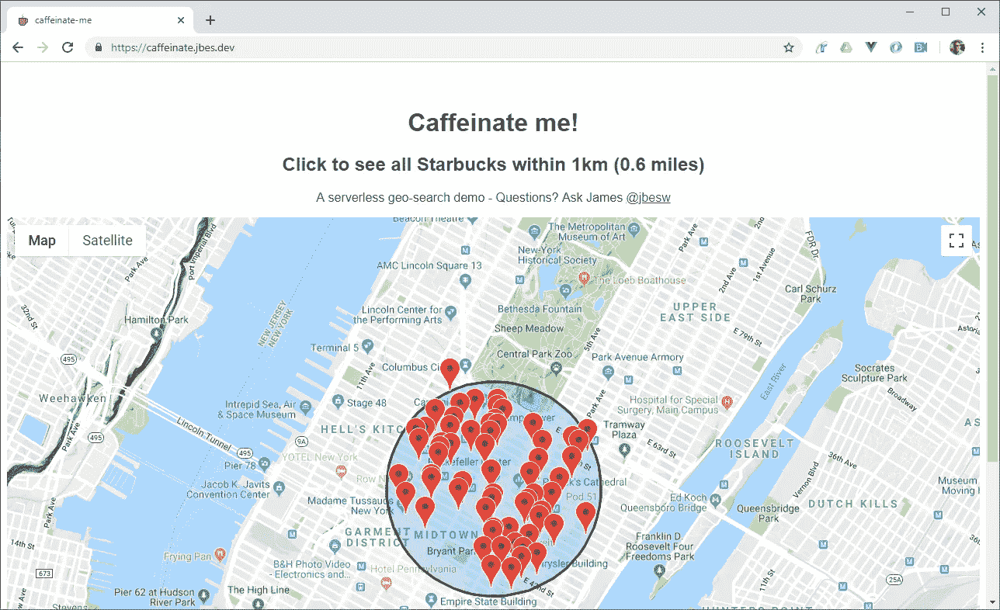

# 给我咖啡因！构建一个无服务器应用程序来查找最近的星巴克。

> 原文：<https://medium.com/swlh/caffeinate-me-build-a-serverless-app-to-find-the-nearest-starbucks-54512124e639>

## 这个项目将 Starbucks 和 serverless 结合在一起，使用 VueJS 和 DynamoDB 上的地理空间查询来提供快速的咖啡定位。

Test it out at [https://caffeinate.jbes.dev/](https://caffeinate.jbes.dev/)

如果你开发移动应用或任何位置感知软件，你会很快遇到一个难题——如何定位“最近的”或…