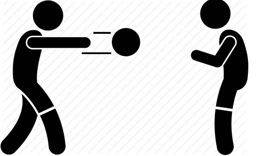

# JavaScript 中的按值调用/按引用调用

> 原文：<https://medium.com/swlh/call-by-value-call-by-reference-in-javascript-c5738600d9cd>

Pass The Value

所以我写 JavaScript 已经有一段时间了，我也帮助我的一些朋友学习 JavaScript，因为他们想进入前端开发。这是我个人最喜欢的话题之一，但我有点惊讶地发现，有多少次，人们都弄错了。

JS 的问题在于它不像其他语言那样遵循通用模式。例如在 C#中， ***ref*** …