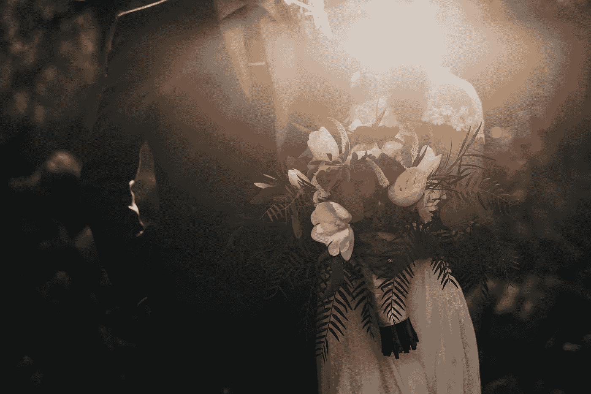

# 冷静点，你不是英雄

> 原文：<https://medium.com/swlh/calm-down-you-arent-the-hero-80f2da8d2015>

> “害羞是一种明显的自我意识，认为你是世界上唯一的人；你的长相和你所做的一切都很重要。”查尔斯·舒尔茨

上周，我在一个好朋友的婚礼上担任伴郎。当我们准备好浆过的衬衫、领结和袖扣时，另一个伴郎问我是否紧张。

“不。”我简单地回答道。这不是我的婚礼。

Photo by [Nathan Dumlao](https://unsplash.com/@nate_dumlao?utm_source=unsplash&utm_medium=referral&utm_content=creditCopyText) on [Unsplash](https://unsplash.com/search/photos/wedding?utm_source=unsplash&utm_medium=referral&utm_content=creditCopyText)