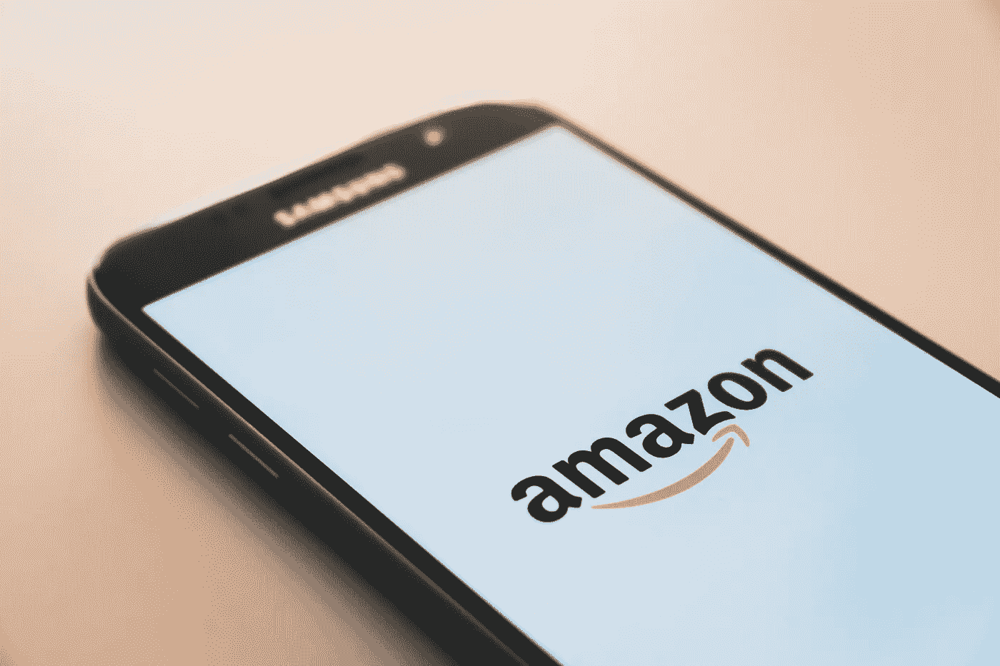

# 亚马逊真的能在海运上做到端到端吗？

> 原文：<https://medium.com/swlh/can-amazon-really-go-end-to-end-in-ocean-freight-279026a6ee47>

早在 2016 年，当亚马逊获得在中美之间经营 NVOCC 的许可证时，整个货运代理行业都在想这对传统的供应链管理专业人士意味着什么。

尽管可以选择出售海运，但亚马逊在此后的几年里基本上进入了最后一英里的交付，与 UPS 和联邦快递(FedEx)等交付服务公司竞争其庞大的小包裹量，而让第一英里和中间一英里的物流公司相对不受干扰。

这是有意义的，特别是考虑到亚马逊送货服务背后的财务负担:运费每年都在上涨，超过 200 亿美元，亚马逊将高成本归咎于配送中心的责任和运输成本等因素。将最后一英里的工作交给内部人员是一种节约成本的策略。

但亚马逊没有忘记它的 NVO 许可证，在过去的一个月里，关于亚马逊最终成长为第三方物流服务提供商的猜测越来越多。《商业杂志》高级科技编辑埃里克·约翰逊是这样说的:

> *“通过 2016 年推出的无船承运商(NVO)，亚马逊无疑对其内部供应链施加了更大的控制，但更重要的是，它可能还在建立一个供应链平台，可以作为一种独特的服务进行营销，甚至向其市场网络之外的发货人销售。”*

那么，亚马逊有计划成为一个活跃的 NVO 吗？实际上更有可能的是，他们的货运计划没有那么狭窄。

**作为全方位服务提供商的亚马逊**

亚马逊有能力成为一个端到端的服务提供商，通过一个门户网站托管，并建立在一个已经有内置用户群的平台上。

如果说去年宣布的“与亚马逊一起运送”是最后一英里的游戏，亚马逊的履行和仓储中心多年来一直充当中间一英里的港口，那么亚马逊的 NVOCC 许可证通过增加亚马逊运营的早期一英里运输选项，完成了他们的整个供应链。就像马士基及其成为端到端供应链服务提供商的努力一样，亚马逊已经在每个环节都有了组件。下一个合乎逻辑的步骤是通过一个专用平台覆盖整个交付交易。

亚马逊平台上的商家网络非常强大，显然有动力将亚马逊作为运输合作伙伴。但亚马逊需要回答的真正问题是:如果买家不是亚马逊的商家，他们能吸引买家使用他们的服务吗？

**品牌平台问题**

我们之前已经报道过**承运商如何开发专门的货运交易平台**。这些平台对“合作货运代理和 NVOCC 的”开放，但尚不清楚合作伙伴是否会使用他们首选的承运人。除了该平台正在开发的运营商，他们不太可能有其他选择。

亚马逊可能面临与第三方物流类似的问题。如果他们的端到端平台的目标是制造商、托运人和商家，用户可能必须专门使用亚马逊的转发和 NVO 服务。如果你还没有整合亚马逊的卖家产品，那么是什么激励你转向亚马逊第三方物流服务呢？

**亚马逊的王牌:定价**

最终，由于专用平台、端到端门户，甚至易用性，亚马逊不会深入全面服务物流世界。他们对海运的最大增值将是定价。

我们知道亚马逊可以控制自己商品的采购成本，因为它有巨大的购买力。但是，如果他们能够将从大宗采购中获得的价值转移给货运代理客户，亚马逊就可以成为一个海洋货运巨头，平等地为电子商务平台上或平台外的客户提供价值。无论压低价格对航运业是否健康，亚马逊都有能力和数量赢得这场逐底竞争。

如果发生这种情况，那么物流和电子商务世界都将发生巨大变化。这两者错综复杂地交织在一起，亚马逊可以使用全方位服务物流来进一步激励商家与亚马逊一起销售。

可以这样想:亚马逊可以使用一个端到端的供应链管理平台作为他们商业服务的引导漏斗。他们很乐意为无与伦比的海运价格买单，如果这能保证更多的人进入他们的电子商务网络的话。

这并不是一个遥不可及的可能性:亚马逊多年来一直将运输作为一种销售工具。现在，他们可能会将这一战略从最后一英里物流带到海洋货运业。

*福阿德·沙里夫是* [*CoLoadX*](http://www.coloadx.com/) *的联合创始人&兼首席执行官，这是一个为海洋货运代理和 NVOCC 提供服务的在线平台。*