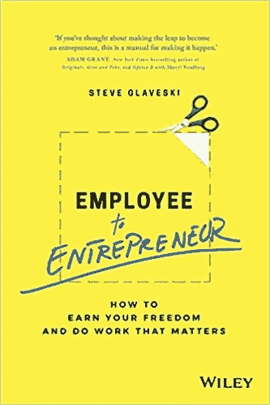

# 员工可以成为企业家吗？

> 原文：<https://medium.com/swlh/can-an-employee-be-an-entrepreneur-396705c417d7>

我最近结束了一次紧张但有益的播客之旅，以支持我的新书《从雇员到企业家》。

我已经在 50 多个播客上出现过，我想我已经被问到了关于实现上述飞跃的所有话题。直到我采访了《超越待办事项清单的 T2》播客的埃里克·费舍尔。Erik 采取了不同的方法，问我员工是否可以…