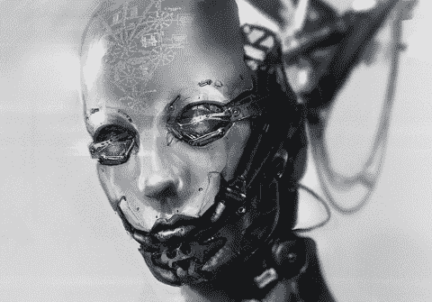

# 人工智能能代替作家的工作吗？

> 原文：<https://medium.com/swlh/can-artificial-intelligence-take-the-job-of-a-writer-4bdaa912f234>

[https://giphy.com/gifs/ai-psychonaut-T5GRPtSpNuu2c](https://giphy.com/gifs/ai-psychonaut-T5GRPtSpNuu2c)

随着即将到来的人工智能革命夺走了许多劳动密集型工作，我们需要思考它们是否能够夺走写作等更复杂的手艺。许多人说这是不可能的，但是我们应该停下来看看我们在技术进步方面的发展速度。这不仅是进化本身，而且是我们不断增长的速度…