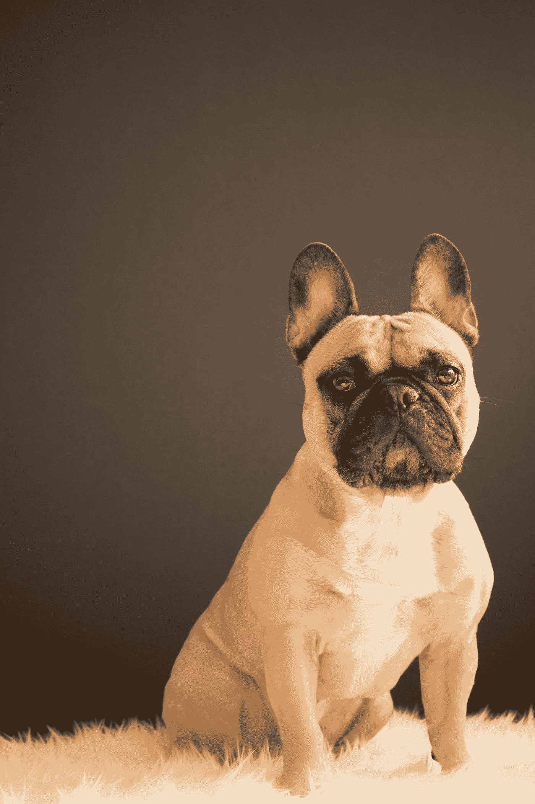

# 狗能闻到癌症吗？

> 原文：<https://medium.com/swlh/can-dogs-smell-cancer-f8740ef5d222>

Photo by [Alexandru Sofronie](https://unsplash.com/@alexsofronie?utm_source=medium&utm_medium=referral) on [Unsplash](https://unsplash.com?utm_source=medium&utm_medium=referral)

> ***“幼犬的信仰是绝对的……狗是出了名的希望。狗相信今天早上，就在今天早上，可能会开始一天的魅力，比过去的任何一天都要盛大。”—唐纳德·麦凯格***

如果人类真的有过朋友，那应该是狗，几乎一半的 T4 家庭都有一只狗。这种曾经的野生动物已经被驯养了将近 32，000 年，成为它们的仆人和朋友…