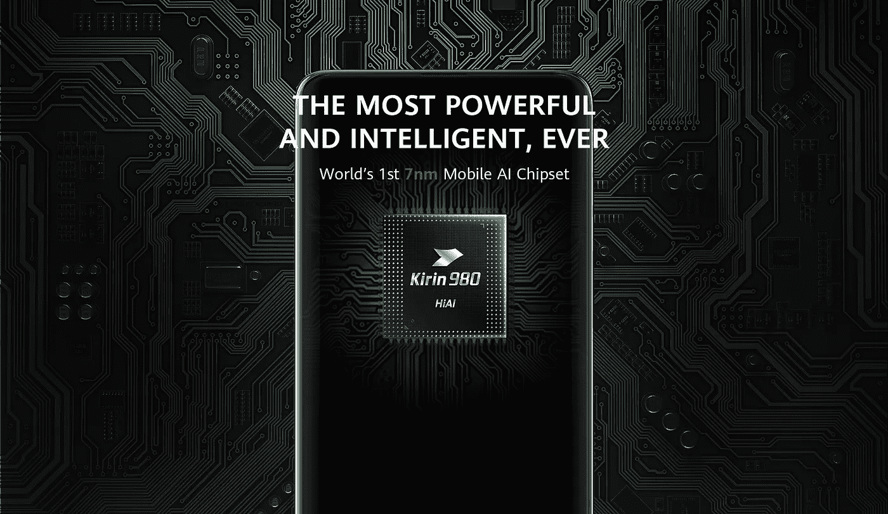

# 华为没有 ARM 芯片组支持能应付吗？

> 原文：<https://medium.com/swlh/can-huawei-cope-without-arm-chipset-support-9cc3c115bbc3>

美国对华为的贸易清单促使全球几家科技公司切断或缩减了与中国电信设备巨头的业务联系。

继谷歌、高通和英特尔等实体采取行动后，华为现在有了更大的担忧——总部位于英国的芯片设计公司 ARM Holdings 决定暂停与这家中国智能手机制造商的业务。

