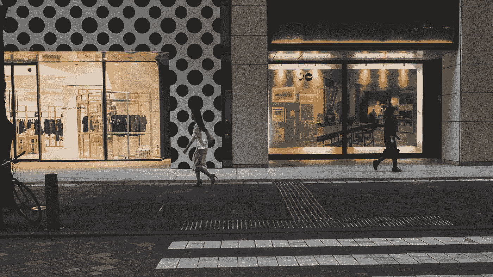

# 本土零售商能与亚马逊竞争吗？

> 原文：<https://medium.com/swlh/can-local-retailers-compete-against-amazon-fade5e05ff5a>

我们在多大程度上经历了“零售业末日”？

Photo by [Simon Launay](https://unsplash.com/photos/9J1EwaanAcw?utm_source=unsplash&utm_medium=referral&utm_content=creditCopyText) on [Unsplash](https://unsplash.com/search/photos/retail-business?utm_source=unsplash&utm_medium=referral&utm_content=creditCopyText)

在过去几年的某个时候,“零售业末日”一词被创造出来。这意味着对于实体零售商来说，这是世界末日。自 2008 年经济衰退以来，截至 2018 年，已有超过 12，000 家实体店关闭，今年还将有超过 5，000 家零售店关闭。