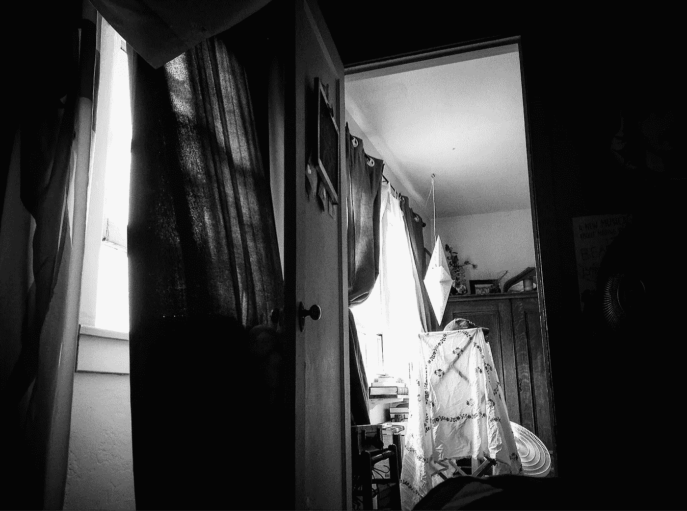

# 我的身体能拯救我吗？

> 原文：<https://medium.com/swlh/can-my-body-save-me-from-myself-2abe70017389>

I awoke from a nap and just had to take this photo.

## 特里普·哈金斯的《被身体包裹的自我》

花时间在我的身体里是……不寻常的。也就是说我很少注意到我有一个身体。我实际上没有脱离肉体。当然不是。我分心了。我迷失在我的想象中，对未来的担忧和对过去的怨恨。我沉思。我屏住呼吸，直到气喘吁吁才注意到。我的身体只是在努力…