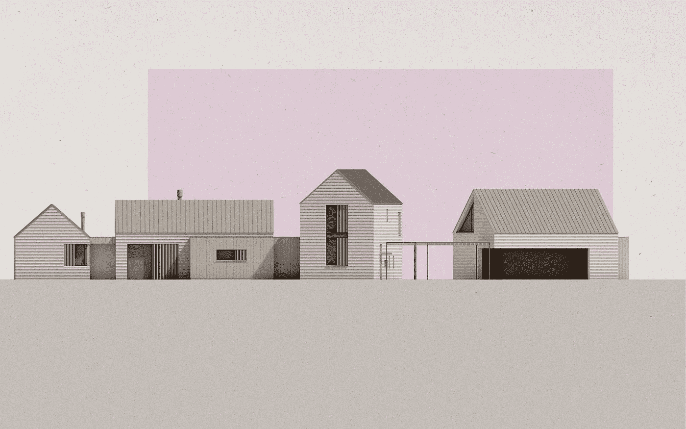

# 当我们变老时，我们的家能被设计成让我们更活跃吗？

> 原文：<https://medium.com/swlh/can-our-homes-be-designed-to-keep-us-more-active-as-we-get-older-45ecce2cbb9f>

三部曲中的第一部。

俗话说:人生只有两件事可以指望:死亡和税收。我想我们都同意，我们都在变老，这意味着在某个时候不再能够住在或访问他们心爱的家园。