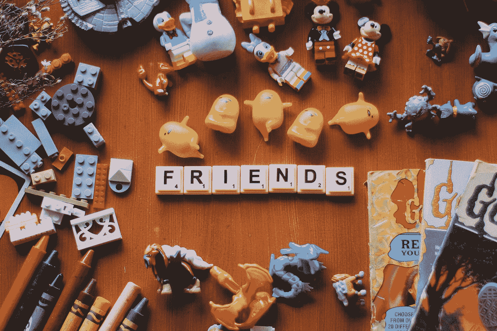

# 玩玩具对写作有帮助吗？

> 原文：<https://medium.com/swlh/can-playing-with-toys-help-your-writing-ce48af4b304a>

Photo by [Hannah Rodrigo](https://unsplash.com/@hannahrodrigo?utm_source=medium&utm_medium=referral) on [Unsplash](https://unsplash.com?utm_source=medium&utm_medium=referral)

# 为什么要用三维物体作为写作提示。

那天，我们写作小组中的一个人站在船屋上吉利的房间里，围着她收集的玩具打转。动作玩偶。火柴盒汽车。羽毛，弹珠，动物，玩具士兵，不匹配的耳环，宗教图标，婴儿车，飞机，娃娃，人形，动物，树木…