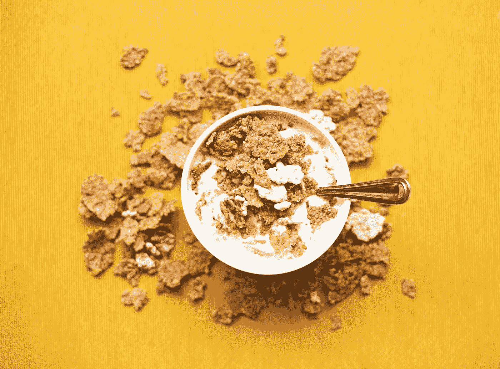

# 不吃早餐真的会杀了你吗？

> 原文：<https://medium.com/swlh/can-skipping-breakfast-actually-kill-you-c48406e76d6f>

## 你是一个习惯性的“早餐船长”吗？

Photo by [Nyana Stoica](https://unsplash.com/@nyanastoica?utm_source=medium&utm_medium=referral) on [Unsplash](https://unsplash.com?utm_source=medium&utm_medium=referral)

我们这里的大多数人在生活中的某个时候都会因为错过了一天中的第一餐而感到内疚。

通常是因为**三个原因**:

1)有饱腹感。

2)上班迟到。