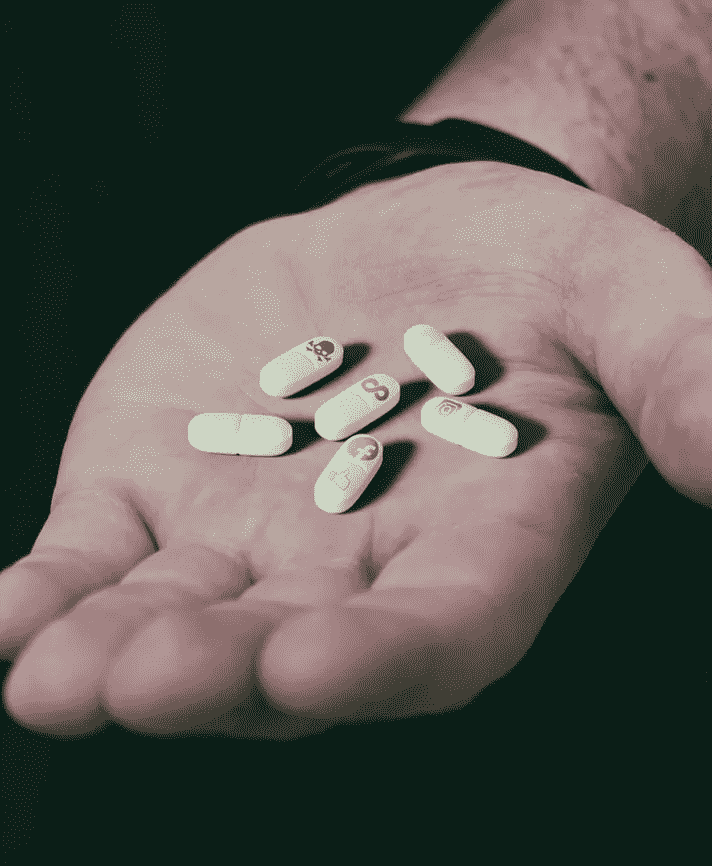
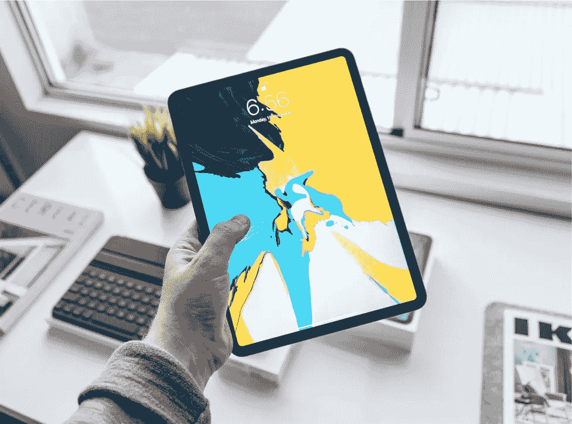

# 社交媒体可以适度积极吗？

> 原文：<https://medium.com/swlh/can-social-media-be-positive-in-moderation-4d9201df54c8>

## 毫无疑问，社交媒体对你有害。

它让你缺乏安全感，不断将自己和自己的物品与他人比较，使你更加与人隔绝，甚至会导致[焦虑和抑郁](https://www.forbes.com/sites/alicegwalton/2018/11/16/new-research-shows-just-how-bad-social-media-can-be-for-mental-health/#5d69771c7af4)。

@marcschaefer via Unspalsh

当然了。我们不断更新我们的 Instagram，看看其他人的生活有多完美。晚上，我们溜上床，检查脸书，结果却在虚空中越滚越深，一滚就是几个小时。我们早上醒来，睡眼惺忪，疲惫不堪，只是为了吃早餐。

也许我们的大脑不适合这么多信息。不断地将自己与他人比较，渴望从自己生活中的不完美中转移注意力。

社交媒体也会扼杀生产力。你打算简单地查看你的订阅，结果却花了一个小时无意识地浏览你的时间线。

> 这些算法旨在让你保持专注；无意识地滚动。

你的注意力是值钱的，所以社交媒体公司想让你一直点击和滚动。

时间线中内容整齐的时间顺序已经一去不复返了，这使得停止滚动变得很容易。以前，你会看到一样东西两次，知道是时候放下手机了。

例如，脸书的算法更喜欢吸引本地用户的内容。你的朋友越喜欢某样东西，它就越有可能在你的时间线中消失。你就会越投入。

也许你看到你的远房表妹刚刚带着一枚硕大的钻石戒指求婚，或者你的老校友在 Instagram 上的某个热带地方啜饮着冰镇果汁朗姆酒。只是环顾你无聊、灰暗的办公室和*的叹息。*要是……

所以你再次打开你的手机。这是一个恶性循环。

# 对精神病患者来说更糟

患有精神疾病的人尤其受到社交媒体的社会影响。社交媒体上对精神疾病的污名化和淡化太普遍了。尽管耻辱感让人觉得他们是社会的一个标记——害群之马，但对精神疾病的轻视会阻碍寻求帮助的行为。

@topich via Unsplash

> 如果你或你认识的任何人需要精神上的帮助，这里有可用的资源。

导致污名的最普遍的帖子包括精神分裂症或偏执的人与暴力的联系。精神分裂症患者经常与社交媒体上被贴上“神经病”标签的暴力行为联系在一起。[情况并非如此](https://www.webmd.com/schizophrenia/schizophrenia-violent-behavior)，精神分裂症患者往往没有暴力倾向。尽管如此，这些标签让患有精神疾病的人觉得自己不像个人。

> 在社交媒体上，很容易说出伤人的话。我们不考虑，但这些话割得很深，留下的只有脆弱。

与此同时，在 Twitter 和 Tumblr 上，精神疾病经常被不知道患有精神疾病是什么感觉的人淡化或浪漫化。*#抑郁症*Tumblr 上的文化让抑郁症看起来美丽迷人。事实上，抑郁远非美好。它又黑又危险；一场艰苦的战斗。

此外，在 Twitter 上，人们经常在#OCD 旁边发关于整洁的推文。这破坏了强迫症的本质——一种对每个人产生不同影响的复杂疾病。

在社交媒体上贬低精神疾病的严重性似乎是无辜的，但这可能是有害的。如果你不得不默默忍受，因为你觉得你的痛苦永远不够？

> “一直以来，我都患有强迫症，却没有意识到。我已经习惯于相信…一种刻板印象，一个谎言。那耽误了我很多年寻求帮助。”— Ginda Hadden， [*为什么强迫症不是为了成为一个洁癖者。*](https://www.huffingtonpost.co.uk/gina-hadden/why-ocd-isnt-about-being-_b_18285794.html)

# 但是社交媒体也不全是坏事

但是社交媒体真的像我们描述的那样糟糕吗？答案和大多数好东西一样，在于适度使用。

社交媒体也有一些积极的方面。圣诞节时，你可以在壁炉旁看着你阿姨的狗的可爱照片，不时地祝你的远房表妹“生日快乐”(也许更多的是出于义务而不是选择)，给你的朋友发消息说你在康提基之旅中见过一次…即使那是一场醉酒的模糊之旅。

脸书也可以建立一种社区意识。一些积极的团体和社区在脸书建立起来，把人们联系在一起。搜索你所在的地区并不难找到园艺小组、摄影俱乐部或诸如此类的组织。这些小组是人们与志趣相投的人联系并寻求建议或指导的好方法。

社交媒体是联系人们的强大工具。记者可以通过连接 Twitter 上的用户远程报道新闻。多亏了社区公告页，走失的猫和狗可以与家人团聚。

当然，也不全是美好的。脸书集团也有怪诞的角落。充满了巨魔和卑鄙的敌意。

也有例外——真正有意义的社交媒体，像脸书声称的那样，连接和满足人们。例如，Quora 是一个积极寻求智慧和学习新事物的地方。

接下来是 Medium，这是一个非常积极的平台中罕见的瑰宝。用户创建强大、有意义的内容，并就共同的兴趣真诚地相互交流。六个月来，我一直是这本书的热心读者，但我还没有从 Medium 的用户那里看到一丝毒性。也许它就在那里，但首先要筛选大量有意义、高质量的内容。

# 答案在于适度

当我在年初完全放弃社交媒体时，我意识到两件事。首先，我是多么依赖社交媒体。删除脸书后，我发现自己不断地去查看它。尽快解锁我的手机几乎是我的第二天性。当然，脸书不在那里，所以我意识到这个习惯有多糟糕。

我的第二个体会是我们在社交媒体上浪费了多少时间。因为我不经常使用社交媒体，所以我有很多空闲时间。事实证明，在媒体上阅读远比跟上人们午餐的内容更有益。

时间是我们最宝贵的资源。这就是公司付钱给脸书和社交网络的原因，也是我们无休止滚动时放弃的东西。

要真正享受社交媒体，我们应该适度使用它。控制我们的上网时间——不要让算法控制我们。

如果我们留意我们在社交网络上花了多少时间，我们就能有效地利用社交媒体。你不用分心几个小时，你可以和你需要的人联系，知道什么时候该回去工作。

有很多很棒的应用程序可以控制社交媒体和电话的使用。苹果提供 Screentime 来帮助你了解你的习惯趋势，并跟踪使用情况。在 Android 上，类似的选择是 Action Dash。

> 让社交媒体远离你的工作电脑。

如果你在办公室工作或在笔记本电脑上学习，不要使用社交媒体。当你有工作要做时，很容易分心或拖延。考虑一下 Coldturkey 的非工作时间，这两者都会阻止你进入你推荐的网站。

你的手机也可能是一个致命的兔子洞。远程互联网连接意味着你可以在任何地方访问你最讨厌的网站。最好的解决办法是删除它们，或者尽可能让它们远离你的主屏幕。

## 使用第二台设备

@henryascroft via Unsplash.

很可能有一部备用手机或平板电脑躺在某个抽屉里，积满灰尘。您可以对此进行设置，并使其成为您的指定社交媒体设备。这将帮助你保持控制，并在工作和休闲设备之间建立一个精神障碍。

我设置了一个旧的 iPad 2，在我们的研究中被用作镇纸。在那里，我有 Instagram、脸书、YouTube 和 Reddit 等应用程序。

有一个单独的设备用于玩游戏，另一个用于工作，这帮助我控制了社交媒体的使用，并更有意识地上网。如今，我很少发现自己在空虚中越滚越深。相反，我活在当下，不会被不断的通知和电子邮件分心。

我也可以用这个 iPad 来跟踪我的屏幕时间，并且知道我在控制。知道社交媒体没有控制我，我就放心了。

> 如果我们任由社交媒体吞噬我们，它可能是有害的。

但它也可以是积极的。如果我们保持控制，并留意*我们如何使用社交媒体，我们就能更好地连接到它的根源——与家人、朋友和社区联系。*