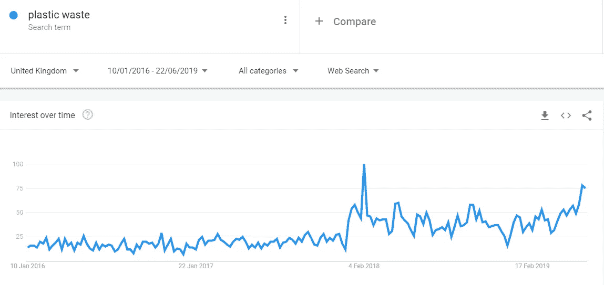
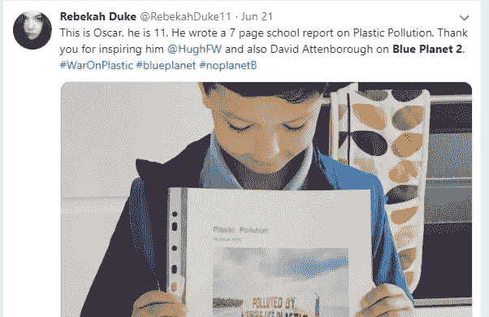
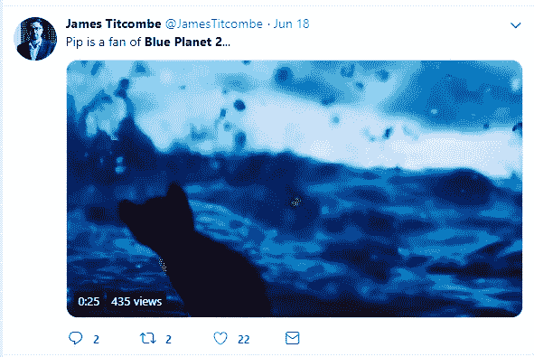
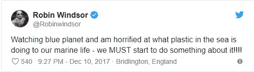
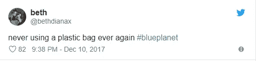
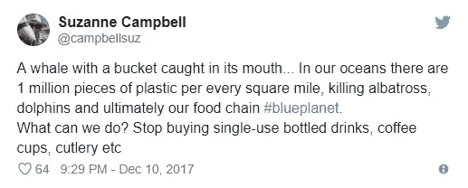
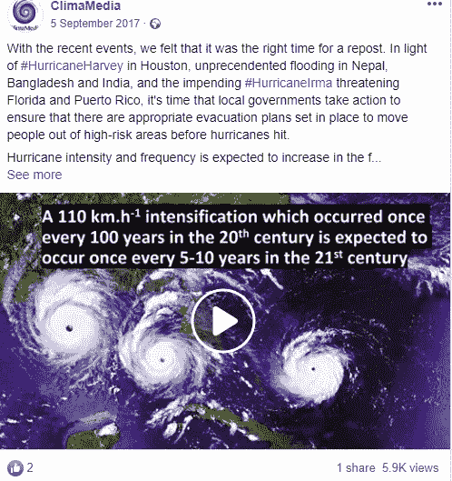
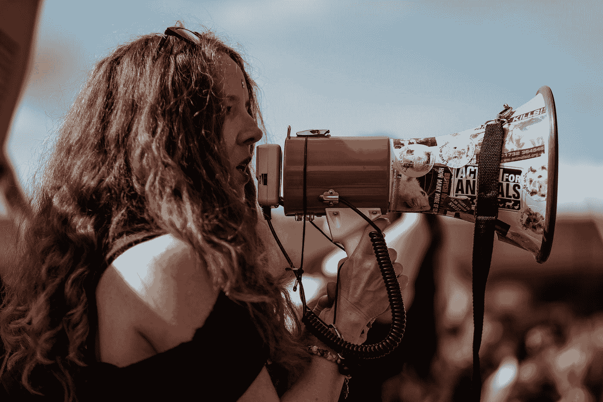

# 社交媒体能从气候变化中拯救我们的星球吗？

> 原文：<https://medium.com/swlh/can-social-media-save-our-planet-from-climate-change-b3b1e81f64f7>

## 使用社交媒体宣传气候变化并提高对气候变化的认识的案例

Photo by [Kym Ellis](https://unsplash.com/@kymellis?utm_source=medium&utm_medium=referral) on [Unsplash](https://unsplash.com?utm_source=medium&utm_medium=referral)

全世界有超过 34 亿人经常使用社交媒体，其中脸书有 22 亿活跃用户，YouTube 有 19 亿，Instagram 有 10 亿，Twitter 有 3.35 亿[1]。

我以前写过[为什么我们需要改变我们谈论](/@tabitha.whiting/why-we-need-to-change-the-way-we-talk-about-climate-change-9e43e9d77228?source=friends_link&sk=aeaf9b7d21c9e8f2f06b5e59f921f8ec)和[的方式来直观地传达气候变化](/@tabitha.whiting/we-need-to-change-the-way-we-visually-depict-climate-change-3033eb8fb129?source=friends_link&sk=993a41204bf417d435de13f53b4254e9)，但这让我认为我们也需要考虑到*我们谈论气候变化的地方*。社交媒体消除了时间和距离的界限，将全球志同道合的人聚集在一起，讨论想法，分享对特定主题的看法。由于气候变化是一个全球性问题，并且将影响(并且已经影响)我们所有人，社交媒体成为沟通气候变化的基本渠道似乎是合适的。

科学研究是气候变化的核心，有助于展示和证明人为(人为)气候变化的影响。然而，这种科学研究的呈现方式与人们现在实际发现新闻和消费内容的方式之间仍然存在巨大的差距。学术研究发表在学术期刊上，一般人不太可能消化和理解——它们通常充满了行话和复杂的技术语言。因此，研究论文一般只被其他学术机构访问。有时，它们可能被记者或决策者发现并分发给更广泛的受众。

鉴于现在有大量的人经常使用社交媒体，这项研究似乎可以通过在社交媒体上分享得到更好的利用。社交媒体能成为我们将学术理论转化为真实对话的方式吗？我们应该集中精力在社交媒体上分享气候变化信息吗？

# 案例研究:蓝色星球 II 效应

大卫·爱登堡的蓝色星球 II 是社交媒体可以用来强化和传播气候变化事实的一个很好的例子。蓝色星球 II 关注我们的海洋，通过公开谈论海洋塑料废物的巨大问题而引起轰动。

这是一个多年来一直在研究议程上的话题。例如，2008 年的一项研究发现，海洋塑料废物是黑海中一个日益严重的问题，每平方公里有 8 至 217 公斤塑料废物[2]。早在 1988 年，科学家们就开始关注海洋中塑料垃圾的数量，特别是对海洋动物和鸟类的影响。但就普通大众的意识而言，这似乎不是一个主要的问题，或者人们真正了解的事情。

直到《蓝色星球 2》的上映。查看谷歌趋势上围绕塑料垃圾主题的谷歌搜索，在 2017 年底和 2018 年初有一个巨大的上升高峰，恰逢蓝色星球 II 的上映。此后，这种兴趣一直保持在较高水平，这表明它产生了持久的积极影响。

《蓝色星球 II》于 2017 年底在电视上播出，但直到今天，社交媒体上关于该系列的讨论仍在继续，特别是在 Twitter 上。以下是这种持续对话的两个例子，使用搜索词“蓝色星球”(2019 年 6 月 22 日)找到:

Blue Planet II continues to inspire people…

…and kittens!

《蓝色星球 2》最后一集播出时，推特上的反应甚至更强烈。最后一集专门关注人类对海洋中塑料垃圾的指责，以及我们现在需要如何采取行动来做些什么，阿滕伯勒在该系列中的最后一句话是:

> “所有生命的未来现在都取决于我们。”
> 
> ——大卫·爱登堡，蓝色星球 II

观众立即在 Twitter 上分享他们的想法，类似下面的帖子比比皆是:

正如你从这些例子中看到的，Twitter 上的对话很快从电视节目的评论转向了行动，以及观众在日常生活中实际上可以为海洋塑料垃圾问题做些什么。你还可以在这里看到几个高调的推特用户:专业舞者和*严格来跳舞*明星罗宾·温莎，主持人和冒险家本·福格尔。两人在 Twitter 上都有大量的追随者，因此他们关于蓝色星球 II 的推文可能会传到电视观众之外的人那里。这就是社交媒体作为气候变化行动主义和沟通的媒介的魅力所在，它让重要的信息传播得更远更广，超出了那些已经感兴趣的人。

# 案例研究:气候媒体

关于气候变化的科学研究可以通过社交媒体更好地交流和分享，这一想法也是博士生阿米尔·埃尔法尼安和洛里·福缅科的想法。这激励他们创办了 [ClimaMedia](http://climamedia.com/index.php/about/) ，旨在:

> “通过积极的社交媒体参与和信息丰富的视频，弥合公众和科学界之间的知识鸿沟。”
> 
> ——气候媒体网站

每周，他们都会选择几篇最近的气候变化研究论文，这些论文主要关注气候变化对人类的影响。然后他们努力从这篇研究论文中创造一个简单的故事线和带走的信息。他们将这个故事转变成一个简单的一分钟视频，用普通的视频片段和简单的文字摘要解释复杂的气候变化研究结果。这些视频然后通过 ClimaMedia 社交媒体渠道分发:和 [Twitter](https://twitter.com/ClimaMedia) 。

正如你所看到的，这个关于飓风影响的短片在脸书气候媒体上被分享后被观看了近 6000 次，将学术期刊的研究成果带入了公众视野。

为了有效地沟通气候变化，我们似乎需要分享信息和公众已经花费时间的研究。目前，这意味着我们需要使用社交媒体。

# 激进主义是否有一个应该下线的时间点？

> “在由单一观点主导的社区中，大多数 Twitter 用户只与志同道合的人互动。”
> 
> —海威尔·威廉姆斯

尽管如此，社交媒体似乎并不是我们用来提高对气候变化的认识和分享研究成果的唯一渠道。

英国研究员 Hywel Williams 对 Twitter 用户及其应对气候变化的方式进行了一项研究。这项研究发现，大多数用户是在对气候变化已经有共同观点的志同道合者的“回音室”中互动——而不是向尚未意识到这个问题的人传播信息。它还发现，当人们在不同的社区(即气候怀疑论者和气候活动家)互动时，这是非常消极的，双方争论而不是有效地交流以分享不同的观点[4]。

> “在由单一视图主导的社区中，大多数用户只与志同道合的人互动。然而，我们也发现怀疑者和积极分子频繁互动的混合态度社区。志同道合的用户之间的信息通常带有积极的情绪，而怀疑者和积极分子之间的信息则带有消极情绪。
> 
> —海威尔·威廉姆斯

如果我们关于气候变化的信息大部分被已经关心的人听到，并希望看到采取行动，那么也许社交媒体并不像它看起来那样是完美的气候变化沟通渠道。它可能有助于传播意识，引发对话，建立社区，但它可能不会引发行动。

这就是我认为灭绝叛乱说得对的地方。他们是一个注重行动的气候组织，其活动在公众面前非常显眼——如果你没有听说最近伦敦的停顿，你一定是生活在岩石下。但他们也非常有效地使用社交媒体，国家概况充当公共关系渠道，分享媒体露面并与记者沟通，当地社区团体允许感兴趣的人密切参与该团体及其线下活动。

最终看来，社交媒体可以成为一个非常有效的交流气候变化的工具。如果我们专注于社区建设并把志同道合的人聚集在一起，那就更是如此。然而，似乎也有一个点，我们必须把我们的气候行动离线，嗯，对它“行动”。

Photo by [Clem Onojeghuo](https://unsplash.com/@clemono2?utm_source=medium&utm_medium=referral) on [Unsplash](https://unsplash.com?utm_source=medium&utm_medium=referral)

# 参考

[1] [Smart Insights 2019 社交媒体报告](https://www.smartinsights.com/social-media-marketing/social-media-strategy/new-global-social-media-research/)

[2][‘土耳其黑海海底西部固体废弃物的丰度和组成’，*水生生态系统健康&管理*，(2010 年 9 月)](https://tandfonline.com/doi/full/10.1080/14634988.2010.503684)

[3] [“收紧海洋塑料污染的网”，*环境:可持续发展的科学与政策*，(2010 年 7 月)](https://tandfonline.com/doi/abs/10.1080/00139157.1988.9930865)

[4] [“网络分析揭示气候变化社交媒体讨论中的公开论坛和回音室”，*全球环境变化*，(2015 年 5 月)](https://www.sciencedirect.com/science/article/pii/S0959378015000369?via%3Dihub)