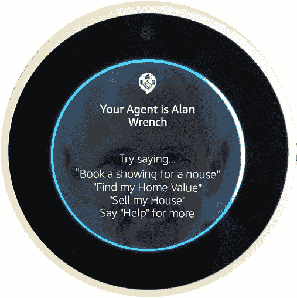

# 像亚马逊 Alexa 和 Google Home 这样的虚拟助手能渗透到房地产市场吗？

> 原文：<https://medium.com/swlh/can-virtual-assistants-like-amazon-alexa-and-google-home-penetrate-the-real-estate-market-a441d1edb214>

在过去的 3 年里，像亚马逊 Alexa 和谷歌 Home 这样的虚拟助手/智能扬声器已经大规模渗透到美国家庭中！增长真的是天文数字。美国家庭中已经有超过 1 亿个亚马逊回声。和几亿个谷歌家园。

这些智能扬声器不引人注目地坐在人们的家中，等待他们的下一个命令，随时准备服务。这就引出了企业的问题，就本文的目的而言，房地产企业。智能音箱能以任何有意义的方式渗透房地产市场吗？

房地产经纪人都是关于线索，线索和线索。但是任何有经验的经纪人都会告诉你，在脸书、Instagram、LinkedIn、Twitter、Google 等网站上花了数千美元后，他们最终会空手而归，或者至少花在广告上的钱与通过这些方法产生的线索的质量不相称。获得优质业务的唯一真正途径是通过回头客或现有客户的口碑推荐。然而，大多数代理人在房屋关闭后不知何故会与他们现有的客户失去联系。这似乎是你可能犯下的最严重的罪行，尤其是当你打算把房地产作为你的生意，希望它能为你服务到你退休，甚至退休以后。

**同时阅读** : [房地产经纪人如何利用亚马逊 Alexa 正在掀起的语音革命？](/voice-tech-podcast/how-can-real-estate-agents-take-advantage-of-the-voice-revolution-that-amazon-alexa-is-stirring-up-acc32d80e7e1)

有些客户关系管理系统会自动向客户发送电子邮件。但是一封生日快乐的电子邮件并不能维持一段关系。事实上，如今大多数用户都足够聪明，能够意识到 CRM 系统正在向他们发送一封固定的电子邮件。他们会立即将其标记为垃圾邮件，或者干脆取消订阅。

那么，在交易完成后，你如何维持与客户的关系呢？答案是给你的客户的生活增加“真正的价值”。在他们需要你的时候出现在他们身边。有像 https://neolocalagent.com 代理尼奥[这样的平台可以帮助你毫不费力地完成所有这些。](https://neolocalagent.com)

代理 Neo 在没有合同的基础上每月收费 14.99 美元，并给你自己的 Alexa 应用程序。一旦你配备了你的 Alexa 应用程序，你就可以把它交给你的客户下载。或者，如果你想给客户送一份结束礼物，只需将你的二维码(一个数字邀请)放入你的礼物中。一旦您的客户下载了您的 Alexa 应用程序，您就可以通过语音命令来满足他们所有的房地产需求。他们可以简单地与 Alexa 谈论任何房屋估价查询、房屋买卖需求。

但是如果他们不想做房地产交易呢？也许他们只是需要帮助修剪他们的后院或维护他们的游泳池。Neo 探员的 Alexa 应用程序也能帮上忙。几乎所有的房地产经纪人都有一份首选承包商名单，比如水管工、电工、泳池清洁工、保姆等。代理尼奥允许他们进入其系统和 wallah 这些！这使得客户可以简单地要求 Alexa“建议某人修复他们的漏洞”或“找人修剪我的后院”。

所以，你有它。通过为客户的生活增加价值来维持客户关系的简单方法。前往 https://neolocalagent.com 了解更多信息。