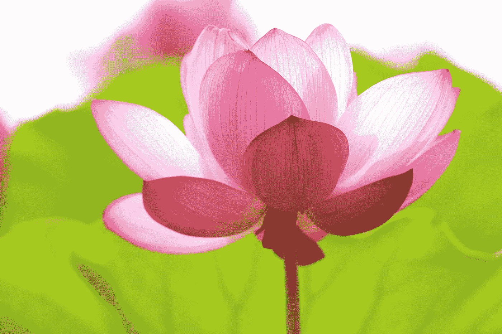

# 你能在日常生活的泥淖中找到纯洁吗？

> 原文：<https://medium.com/swlh/can-you-find-purity-in-the-mud-of-everyday-life-5318818856e8>

## 纯洁不是生活在分离中

Photo by [kazuend](https://unsplash.com/@kazuend?utm_source=medium&utm_medium=referral) on [Unsplash](https://unsplash.com?utm_source=medium&utm_medium=referral)

**纯洁是什么样子的？**’*它是白色的或晶莹剔透的或由光做成的*，‘我听你说。

**纯洁住在哪里？在山顶上，在一个隐蔽的山谷里，或者在天堂之门的另一边。**