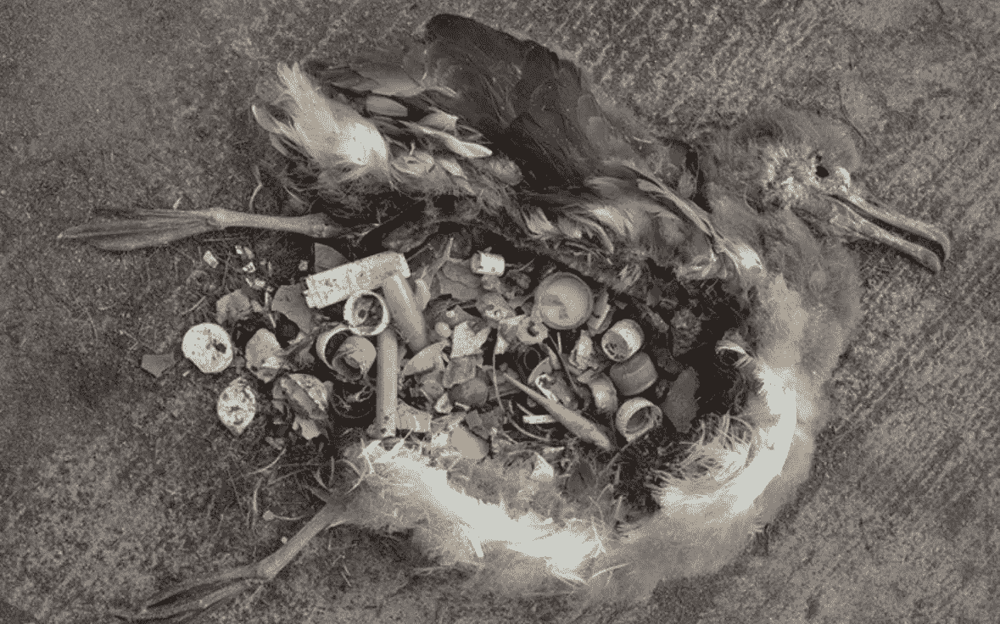

# 你能绿色旋转你的生意来帮助拯救地球吗？

> 原文：<https://medium.com/swlh/can-you-green-spin-your-business-to-help-save-earth-656d1ca4e03a>

提示:纺织是营销，纺织是综合生产。越来越多的商业设计走向绿色

Plastic pollution requires integrated solutions, Christyl Rivers

气候变化已经成为气候危机，这一点已经相当确定。商业和企业驱动的消费往往被描绘成坏人。但是，跳出“生意不好”和“环保好”的二元信念，我们需要更多的思考。