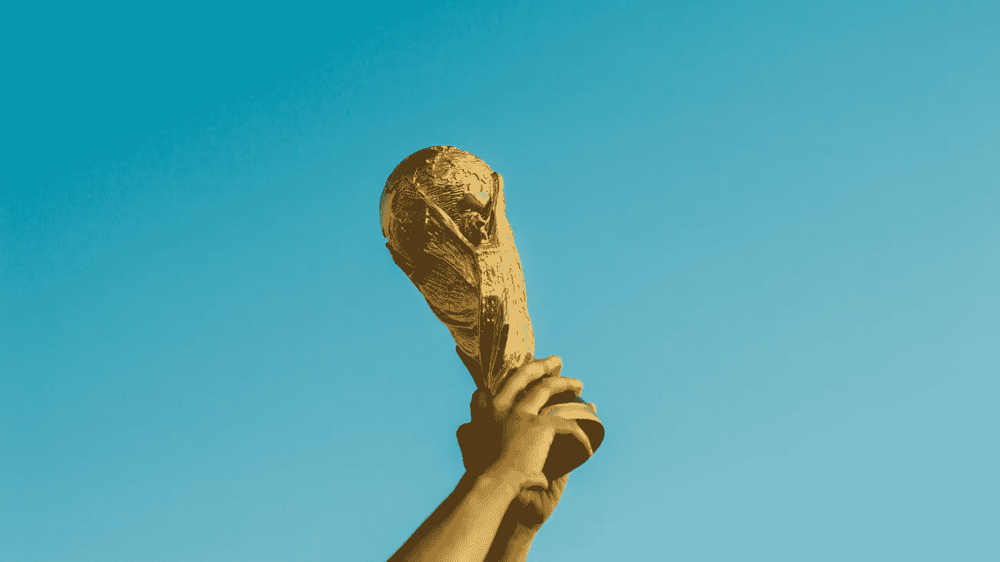
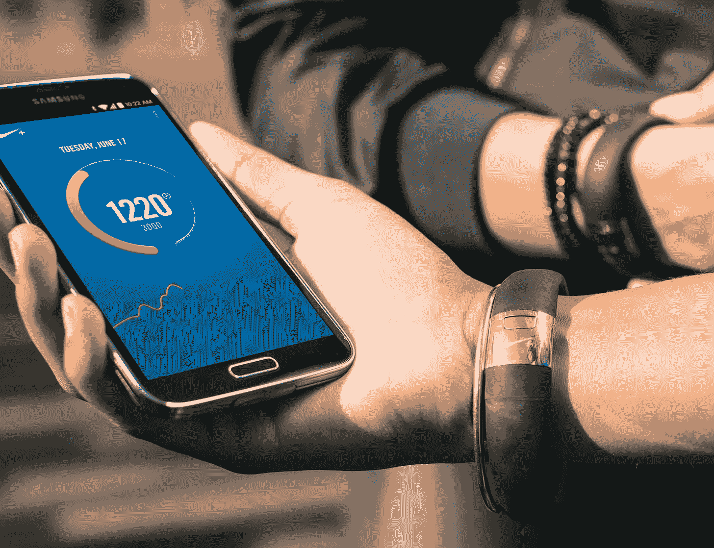
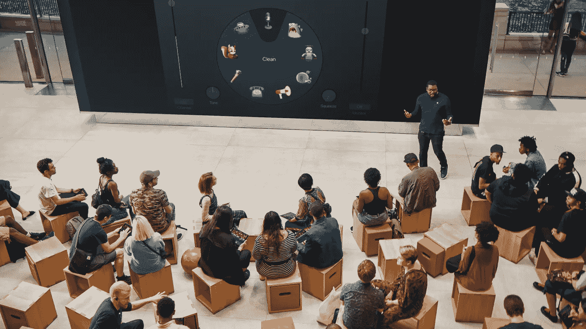
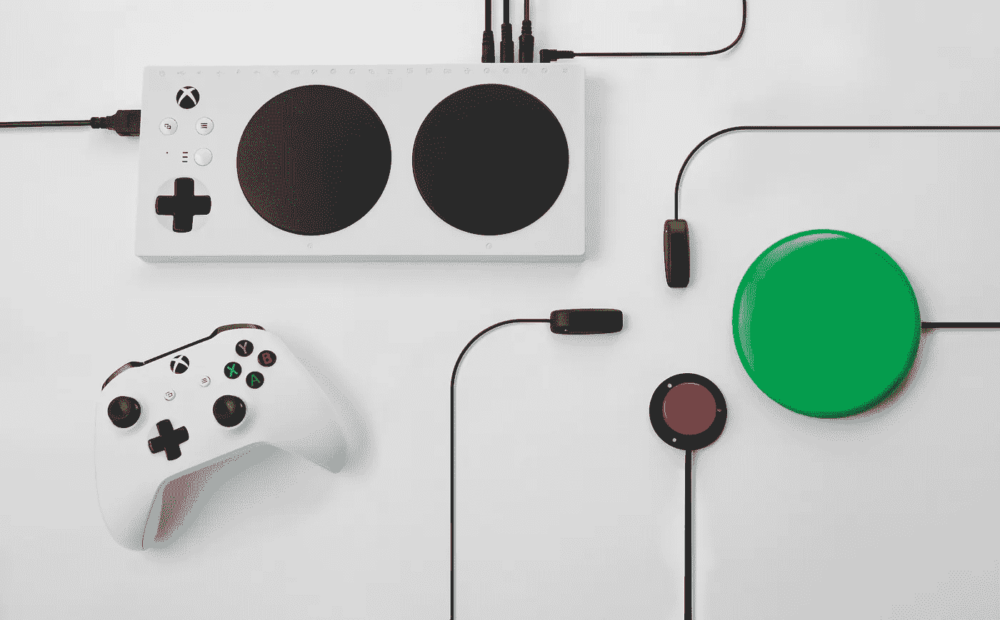
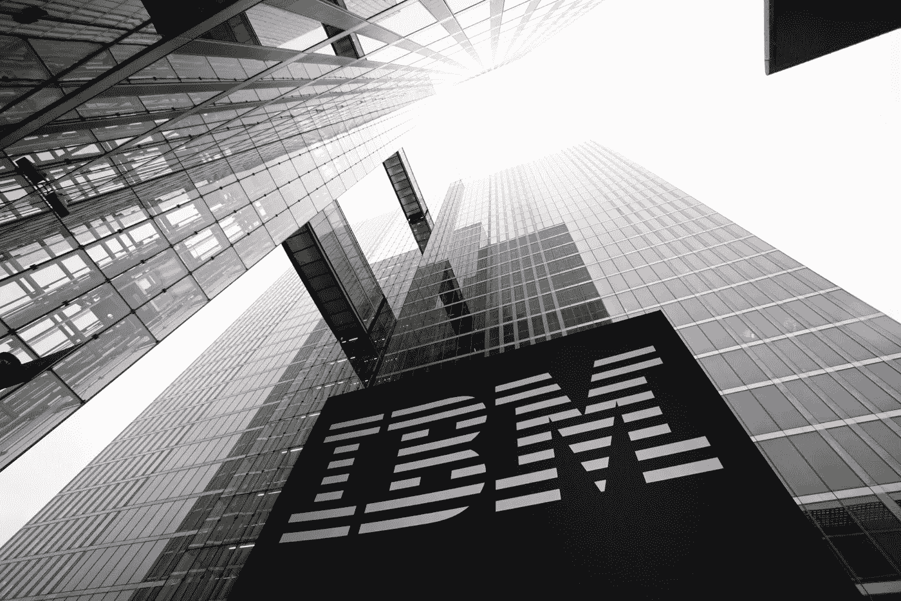

# 戛纳国际电影节评论:从接触点到信任点

> 原文：<https://medium.com/swlh/cannes-lions-review-from-touch-points-to-trust-points-7da7d395bf20>

## 重新定义人与品牌的关系

Photo by [Fauzan Saari](https://unsplash.com/photos/AmhdN68wjPc?utm_source=unsplash&utm_medium=referral&utm_content=creditCopyText) on [Unsplash](https://unsplash.com/?utm_source=unsplash&utm_medium=referral&utm_content=creditCopyText)

如果你在一个创造性的领域工作，你可能会梦想赢得一个奖项，一个对你工作的认可，一些可以向你未来的客户展示你有多好的东西。

然而**，设计和用户体验最重要的奖项是什么？**

我试图分析*戛纳电影节*，世界上最有魅力的电影节之一，以了解这一事件多年来是如何变化的。我关注的是奖项本身与其对市场的影响之间可能存在的关联。

对于那些在创意传播、广告和相关领域工作的人来说，戛纳电影节是一个潜在的职业改变事件。

自从 20 世纪 40 年代末第一次举办以来，这个节日已经发生了很大的变化。前身为*【国际广告节】*，2012 年更名为*【国际创意节】*。在这一演变过程中，组织者不得不应对一些相关的市场变化。新品类就是这样推出的，比如 2008 年的*设计狮*，2012 年的*移动狮*，2013 年的*创新狮*。

但是戛纳电影节不仅仅是关于狮子的；它举办了许多活动和会议，来自世界各地的人们聚集在一起讨论与创意产业相关的话题。这些人早已习惯于谈论广告和营销活动，但他们只是在最近才开始谈论产品、服务和技术。2018 年，整个会议都围绕创新和区块链、数据驱动的创造力和人工智能等主题举行。

最重要的转折点要追溯到 2012 年，当时 RG/A 凭借项目 *Nike Fuelband* 赢得了一个奖项。Fuelband 不是一场营销活动或传统广告。 *Fuelband* 是一种跟踪你所有日常活动的设备，它将这些活动转换成一种叫做“燃料”的通用指标，也可以和别人的进行比较。Nike Fuelband 同时是一种产品和服务，一种高度功能化的体验，可以刺激用户，并使 Nike 在体育产业中获得更强大的地位。

Credit: Nike

2018 年的获胜者是 *Today at Apple，*这是一个在 450 多家商店中提供的教育项目，每个人都有机会了解更多关于苹果产品的信息。这不仅仅是推广，这是如何产生影响并吸引用户的一个重要例子。

Today at Apple Credit: Apple

今年的品牌体验和激活大奖颁给了纽约麦肯公司的微软活动“*改变游戏*”

*改变游戏*推广新的[自适应 Xbox 手柄](https://www.xbox.com/en-US/xbox-one/accessories/controllers/xbox-adaptive-controller)。这个项目不仅改变了人与品牌之间的关系，而且**创造了真正的变化**，它对人们的生活产生了巨大的影响，比如产生信心。

The Xbox Adaptive Controller — credits: Microsoft

随着时间的推移，戛纳电影节的参与者发生了巨大的变化，广告和创意让位于设计和创新。上一届电影节的几项主要活动由脸书、谷歌和 Twitter 等科技巨头主办。**高科技公司已经形成了强大的设计文化**，如*IBM IX*—*IBM*的战略设计和技术导向部门。

IBM IoT Tower — Credit: IBM

那么，戛纳和它的狮子们下一步会做什么呢？不断的变化是生存的关键，朝着创新的强大动力正是市场所需要的。

Lions 类别在过去十年中有所增加，但当核心是创新时，很难定义类别。项目将减少界限，品牌将拥抱更大的图景，不再关注单一资产，**从“接触点”转向“信任点”**
广告公司一直在经历盈利能力下降，他们弥补这一市场损失的方式是收购设计公司。大公司做得更多，他们正在他们的组织内创造一种设计文化。

真正的赢家有强大的文化，**文化比节日更长久。**