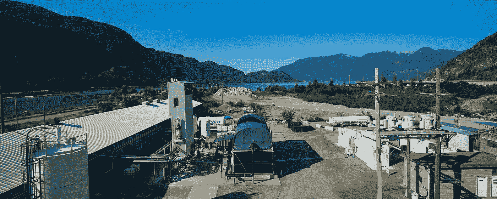

# 资本主义与气候变化:前线采访 I

> 原文：<https://medium.com/swlh/capitalism-vs-climate-change-front-line-interview-i-e51e6d913924>

## 一位家族办公室的碳工程投资者讨论了他的动机和过程

Carbon Engineering’s Squamish, British Columbia test facility. Source: Carbon Engineering

在发表了[我的上一篇关于碳工程](/@Framework_Erik/a-historic-inflection-point-in-capitalisms-battle-against-climate-change-6a8e6a9eeb76)的文章后，我花了一些时间和三位在气候变化投资前线的投资者交谈，这家加拿大公司是由杰出的哈佛科学家[大卫·基恩](https://keith.seas.harvard.edu/)创立的；他们都…