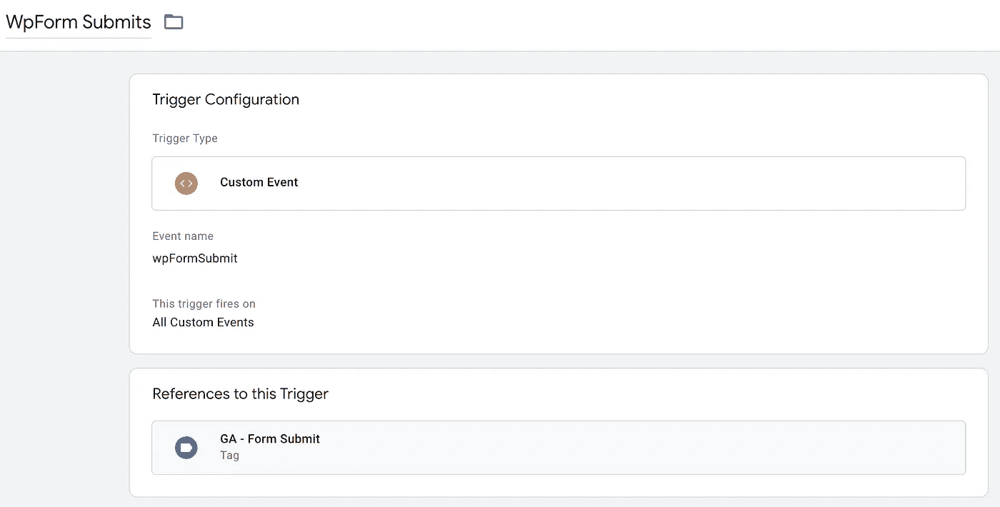

# 在 Google 标签管理器中捕获 wpForms

> 原文：<https://medium.com/swlh/capture-wpforms-in-google-tag-manager-21af6b51d1b7>

## 如何使用 Google 标签管理器检测和捕获 wpForm 提交和数据


用 Google Tag Manager 捕获表单提交经常是一件痛苦的事情，因为 GTM 内置的表单触发器[并不适用于所有的表单](https://www.simoahava.com/analytics/track-form-engagement-with-google-tag-manager/#2-why-the-form-trigger-doesn-t-always-work)。

不幸的是，这个触发器对最流行的 WordPress 表单插件之一 [wpForms](https://wpforms.com/) 不起作用。然而，只需一点点 javascript，我们就可以创建一个健壮的工作区，将 wpForms 提交发送到数据层，GTM 可以在那里检测到它。

*你可以在这里* 抓取 javascript 和 GTM 菜谱[](https://gist.github.com/kmclaugh/fad1431b1916f3776814f1a248f7a4b8)

*[*订阅我的简讯*](https://slideruletech.com/subscribe/tech-tips/?mcsul=https://medium.com/swlh/capture-wpforms-in-google-tag-manager-21af6b51d1b7&)*

# *java 描述语言*

```
*// This code notifies Google Tag Manager when a wpForm is submitted
document.addEventListener("DOMContentLoaded", function() {
  var elementsArray = document.querySelectorAll('[id^="wpforms-form-"]');
  elementsArray.forEach(function(elem) {
    elem.addEventListener("submit", function(e) {
      window.dataLayer = window.dataLayer || [];
      window.dataLayer.push({
        event: "wpFormSubmit",
        wpFormElement: event.target
      });
    });
  });
});*
```

# *它是如何工作的*

*所有的 wpForms 都有一个`id="wpforms-form-XXXX"`，所以脚本首先找到页面上 id 以`"wpforms-form-"`开头的所有表单，并为每个表单添加一个事件监听器。*

*事件监听器在每次提交表单时触发，并简单地将名为`"wpFormSubmit"`的 [**自定义事件**](https://support.google.com/tagmanager/answer/7679219?hl=en) 与提交的表单元素一起推送到数据层(稍后将详细介绍)。*

**

# *怎么加*

*如果可以的话，你应该使用像[简单定制 CSS 和 JS](https://wordpress.org/plugins/custom-css-js/) 这样的插件将脚本直接添加到你的 WordPress 站点的头部。这看起来是这样的:*

**

*如果你没有 WordPress 站点的管理员权限，或者由于某种原因不能将脚本直接添加到站点，你可以通过解开菜谱中的 **wpForm Add Event Listener** 标签从 GTM 运行脚本:*

**

# *如何使用它*

*如上所述，脚本将一个`"wpFormSubmit"`事件和提交的表单元素推送到数据层。为了实际捕捉这些信息，例如，将它发送给 Google Analytics，您必须创建一些 GTM 触发器、变量和标签(示例包含在[食谱](https://gist.github.com/kmclaugh/fad1431b1916f3776814f1a248f7a4b8#file-2-wpform-tag-manager-recipe)中)。*

*首先，您将创建一个在提交 wpForm 时触发的触发器。为此，创建一个 [**自定义事件触发器**](https://support.google.com/tagmanager/answer/7679219?hl=en) ，如下所示:*

**

# *捕获表单数据*

*如果您只有一个 wpForm，那么您可以在这里停下来，使用这个触发器来做您想做的任何事情。*

*但是如果您的站点上(或同一页面上)有多个 wpForms，您可能希望捕获提交的表单的 id。为此，首先必须在 GTM 中创建一个 [**数据层变量**](https://www.simoahava.com/analytics/variable-guide-google-tag-manager/#5-data-layer-variable) 来访问脚本推送到数据层的`wpFormElement`，如下所示:*

**

*接下来，您将创建一个 [**自定义 Javascript 变量**](https://www.simoahava.com/analytics/variable-guide-google-tag-manager/#4-custom-javascript) ，它从 **wpFormElement** **数据层变量**中提取表单 id。看起来是这样的:*

**

```
*function() {
  var wpFormId = {{wpFormElement}}.id;
  return wpFormId ? wpFormId : undefined;
}*
```

*注意，我们的 **wpFormElement** **数据层变量**实际上是一个 javascript 对象，包含了所有提交的表单信息。所以我们可以使用如上所示的 [javascript 点符号](https://developer.mozilla.org/en-US/docs/Web/JavaScript/Reference/Operators/Property_accessors)来访问 id。或者我们可以访问表单的动作，也使用点符号，如下所示:*

**

```
*function() {
  var formAction = {{wpFormElement}}.action;
  return formAction ? formAction : undefined;
}*
```

*或者我们甚至可以访问用户在表单中提交的值，如下所示:*

**

```
*function() {
  var field = {{wpFormElement}}.elements.item(0) //First element of form
  return field ? field.value : undefined;
}*
```

*这个变量将返回表单的第一个输入。例如，对于这种形式:*

**

*它将返回名字的值，即 Kevin。*

*Simo Ahava 在这里有一篇关于访问不同表单值的文章[。只要把他的`"{{Form Element}}"`换成我们的`"{{wpFormElement}}"`就行了，应该是一样的。](https://www.simoahava.com/analytics/track-form-engagement-with-google-tag-manager/#5-capture-field-value)*

*请记住，虽然您可以在 GTM 中捕获个人身份信息，但是您不能将这些信息发送到 Google Analytics。*

# *将表单数据发送到 Google Analytics*

*现在您可以检测 wpForm 提交并将表单数据放入 GTM 变量中，您可以将这些信息发送到任何您喜欢的地方——Google Analytics、脸书等。大多数时候，你至少会想把它作为一个事件发送给 Google Analytics。这就是我们想要的:*

**

# *摘要*

*你可以改进脚本和 GTM 方法，使其适用于 GTM 内置的表单触发器无法检测到的许多其他类型的 WordPress 表单插件。为此，您需要更改脚本的 query selector“WP forms-form-”，以匹配插件使用的任何 id 模式。*

*由于很多网站使用 WordPress，而且几乎每个人都想跟踪表单提交，我希望你会发现这个脚本既健壮又灵活。*

*和往常一样，请随意在下面留下评论，或者[联系](https://slideruletech.com/contact/)如果你需要在谷歌标签管理器中实现这个或任何其他东西的帮助。*

**获取更多科技小技巧，* [*订阅我的简讯*](https://slideruletech.com/subscribe/tech-tips/?mcsul=https://medium.com/swlh/capture-wpforms-in-google-tag-manager-21af6b51d1b7&) *！**

**原载于 2019 年 5 月 20 日 https://slideruletech.com*[](https://slideruletech.com/posts/capture-wpforms-in-gtm/)**。***