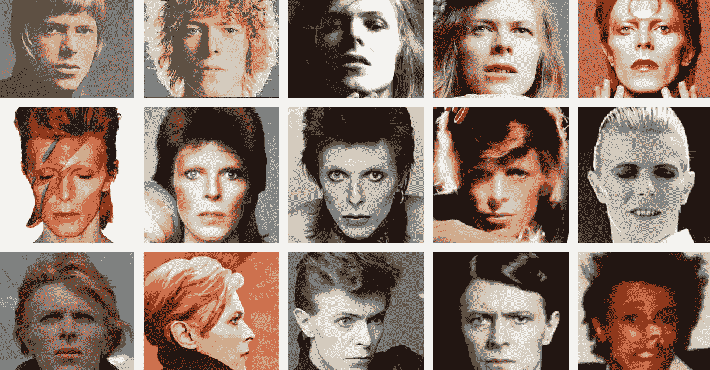

# 职业燃料:像鲍伊一样

> 原文：<https://medium.com/swlh/career-fuel-be-like-bowie-adf6eb462339>

Image via Vox

2016 年一个寒冷的伦敦早晨，我前往梅菲尔的稀有气候区参加一个会议。

那是一月中旬，就在大卫·鲍依去世几天后。

我的主人的职业让他接触到了很多有趣的人，他们来自商业和创意领域。我们讨论了创业、自由职业、新的代理模式和其他事情。