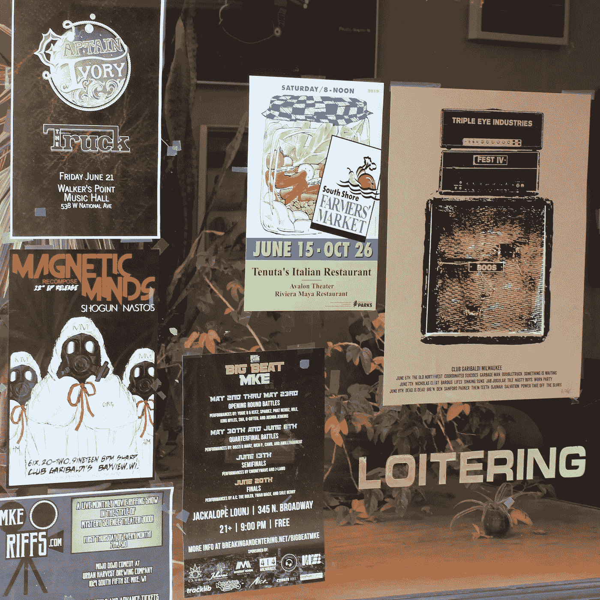

# 案例研究:最强大的营销内容

> 原文：<https://medium.com/swlh/case-studies-the-most-powerful-piece-of-marketing-content-available-4e81c4ba51aa>

## 这是集极具冲击力的销售信函、推荐书和“搂着你的肩膀”为一体的宣传材料。

Some posters in a store front window.

我是在电视购物、滑稽的海猴子漫画书和充斥电视广播的“运营商准备好了”广告的时代长大的…