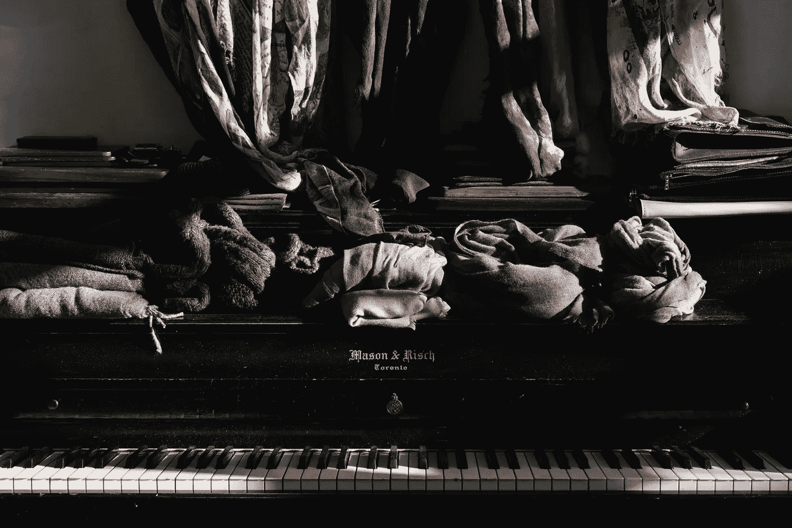

# 扔掉杂物

> 原文：<https://medium.com/swlh/cast-out-the-clutter-e3daab917fe7>

每个月，我们当地的旧货店都会打电话来问我们有没有捐款，每个月我们都会说，“当然，我们会在门廊上给你留一个袋子。”它迫使我丈夫和我每 30 天就要走一遍我们的整个房子，翻遍我们所有的壁橱，问我们自己什么不再有用，什么我们已经厌倦了，或者什么我们永远不会用，尽管我们一直认为我们可能会用。

Photo by [Celia Spenard-Ko](https://unsplash.com/@ceeesk?utm_source=unsplash&utm_medium=referral&utm_content=creditCopyText) on [Unsplash](https://unsplash.com/search/photos/mess?utm_source=unsplash&utm_medium=referral&utm_content=creditCopyText)