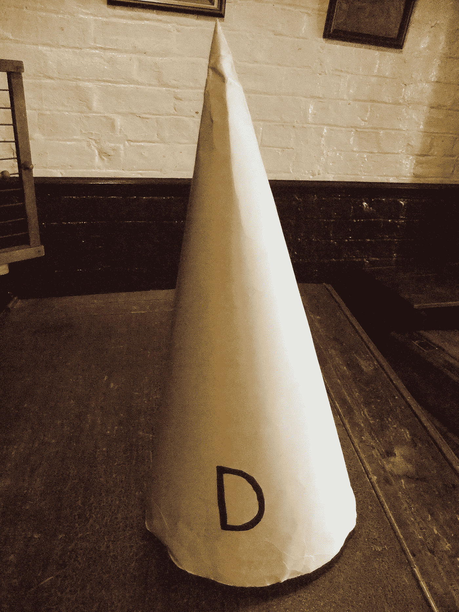

# 疾病预防控制中心继续偏离灾难性阿片类药物指南，而团体推动隐私侵犯措施

> 原文：<https://medium.com/swlh/cdc-continues-to-deflect-for-catastrophic-opioid-guidelines-while-groups-push-privacy-invading-b53886a75d4a>

[Wikimedia Commons](https://medium.com/u/c329b6eef5c6?source=post_page-----b53886a75d4a--------------------------------) —> [Green Lane](https://commons.wikimedia.org/wiki/User:Green_Lane)

## ACHS 的乔希·布鲁姆博士仍然是科学理性的孤独代言人

我已经有一段时间没有去拜访乔希·布鲁姆博士 **。**