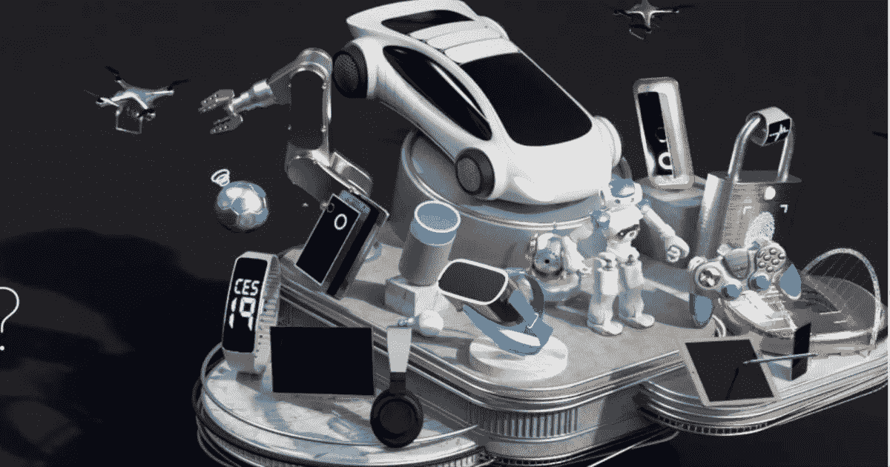

# CES 2019:少数讲座和小组讨论笔记

> 原文：<https://medium.com/swlh/ces-2019-notes-on-few-talks-and-panels-e0185311694d>

臭名昭著的消费电子展(CES)上周刚刚结束——今年，它完全是关于人工智能、电子竞技和家庭自动化的。对于那些不能参加的人，这里有一些我个人最喜欢的精选片段。

***一月七日星期一***

# CES 2019 趋势观察-研究峰会