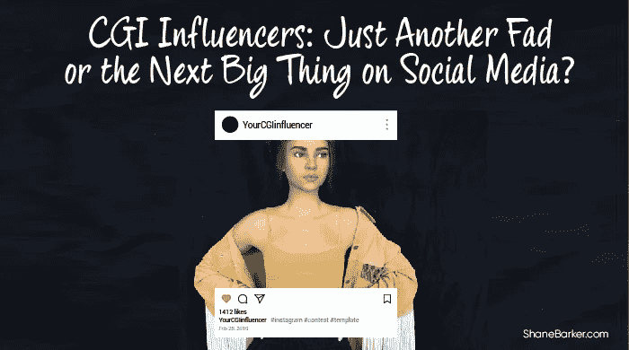

# CGI 影响者:只是另一种时尚还是社交媒体的下一个大事件？

> 原文：<https://medium.com/swlh/cgi-influencers-just-another-fad-or-the-next-big-thing-on-social-media-118704400954>

影响者营销是当今市场营销的流行语。使用影响者营销的 92%的营销人员认为这是有效的。从奢侈品牌到夫妻店，几乎每个人都想尝试影响者营销来推广他们的产品。

但你知道在影响者营销领域掀起波澜的最新一批数字明星是谁吗？影响者营销模块上的最新图标是计算机生成的图像或 CGI 影响者。

精选的相关内容:

*   [insta gram 上的 11 位顶级时尚影响力人物以及为什么要与他们合作](https://shanebarker.com/blog/instagram-fashion-influencers/)
*   [2019 年你需要知道的 15 大电竞影响力人物](https://shanebarker.com/blog/esports-influencers/)

是的，你没听错。

这些影响者不是真实的，也不是人类。正如“CGI 影响者”这个名字所暗示的，他们是由计算机生成的。但是他们已经开始革新影响者营销。他们确实是影响者营销领域的下一个大事件。

# 谁是 CGI 的影响者？

乍一看，可能很难从任何其他影响者中识别出一个 CGI 影响者。CGI 影响者穿着真正时尚品牌的时尚服装，在当地最高档的餐厅用餐。

或者至少他们看起来是这样。

你可以看到他们与名人合影，在充满异国情调的地方与朋友闲逛。他们的社交媒体反馈经常看起来好得令人难以置信。

那是因为他们不是。

CGI 影响者是虚拟制造的，他们所做的一切都是由设计师和程序员精心制作的。他们发布的任何内容都会被后台的社交媒体经理团队讨论数小时。

但是不真实一点都没有影响他们的人气。拥有数百万的追随者，他们中的一些人正在迅速获得比著名的名人和有影响力的人更多的追随者。

CGI 影响者出现在社交媒体上只有几年时间。所以，他们的生活充满了惊奇和魅力。他们长什么样？他们在做什么？他们要去哪里？他们是真的吗？这些问题让用户不断回头查看他们的个人资料。对周围的一切都有好奇心。

这些栩栩如生的数字影响者的创造者非常了解这一点。为了满足这种令人振奋的兴趣，它们的创造者赋予了它们与众不同的个性。他们被赋予了虚构的背景和一套他们所倡导的政治和社会信仰。

这样，创作者想给他们的个性赋予几个层次，使他们看起来与人类非常相似。当谈到在社交媒体上表达自己时，CGI 影响者也不会退缩。

他们的简介充满了长长的、诚实的、相关的标题，引发了争议和讨论。他们无畏地表达自己的意见。他们做的和说的一切都是为了激发和唤起用户的强烈反应。正因为如此，他们中的大多数人已经赢得了忠实的粉丝群。

精选的相关内容:

*   [如何成为有影响力的人——初学者指南](https://shanebarker.com/blog/how-to-become-an-influencer/)

# 数字角色的崛起

甚至在 CGI 影响者出现之前，数字角色就已经很流行了。初音未来是第一批数字角色中的一员，他是一位日本流行歌星，每年都会去 T2 进行世界巡演。

最初，初音未来只是一个拥有女性声音的软件语音库。用户可以输入任何歌词，并听到初音未来的声音。为了配合声音，他们创造了一个动画角色的形象。

随着这个角色越来越受欢迎，艺术家和设计师开始尝试这个角色。这要追溯到 2007 年。

现在，她在脸书上有 200 多万粉丝。她还有一个单独的视频游戏头像，一个人偶，甚至一个动漫角色。2013 年，路易威登的标志性时装设计师马克·雅可布甚至设计了她的巡演服装。

那时，品牌开始认识到这些数字角色的真正潜力。在某种程度上，这真的为 CGI 影响者的进入铺平了道路。

# 会见受欢迎的 CGI 影响者

# 1.莉莉·密凯拉

Lil Miquela 拥有超过 130 万粉丝，是最受欢迎的 CGI 影响者之一。2018 年，她还被《时代》杂志评为互联网[最具影响力人物](http://time.com/5324130/most-influential-internet/)之一。

在她近三年的虚拟生活中，她已经与普拉达和迪塞尔等大品牌合作，并在 GQ 和时尚等杂志上亮相。

由洛杉矶科技初创公司 Brud 创建的 Lil Miquela 甚至被展示为 LGBTQ 权利和黑人的命也是命等事业的倡导者。她的创作者将她描绘成一个 19 岁的巴西裔美国女孩，梦想有一天在洛杉矶成为一名歌手。

精选的相关内容:

*   [识别虚假 Instagram 影响者的 5 个最聪明的技巧](https://shanebarker.com/blog/fake-instagram-influencers/)

# 2.百慕大

同样是由 Brud 创建的，Lil Miquela 在 Instagram 上的许多帖子中都提到了百慕大。百慕大在 Lil Miquela 六个月后加入 Instagram，但她只有微不足道的 12.6 万名粉丝。

在她加入后，百慕大和 Lil Miquela 被描绘成在网上发生口角，这激起了他们粉丝的兴趣。经过一番戏剧性事件，两人成了朋友。

最初，百慕大也被描绘成唐纳德·特朗普的忠实支持者。但是她改变了主意，公开说她已经进化并超越了那个阶段。

# 3.布劳科

作为 Brud 的另一个创作，Blawko 是 Instagram、Twitter 和 YouTube 上为数不多的 CGI 模特之一。他经常炫耀街头服装，并在大多数帖子中喜欢用面具遮住下脸。

作为布鲁德家族的一员，他也和密基拉岛和百慕大群岛混在一起。去年，他与百慕大的关系时好时坏。

在他的 YouTube 频道上，Blawko 每周三都会上传一段视频。他的视频内容从星座视频到韩国流行音乐评论。他在 Instagram 上有 13.6 万名粉丝，在 YouTube 上有 3300 名订户。

精选的相关内容:

*   [如何成为 Instagram 的影响者并开始赚钱](https://shanebarker.com/blog/how-to-become-an-instagram-influencer-and-earn/)

# 4.蜀都

被称为世界上第一位数码超模的蜀都曾为巴尔曼和芬迪丽人做过模特。她还在*《Vogue》澳大利亚版*和*《Cosmopolitan》杂志*上发表社论。

由英国摄影师卡梅隆-詹姆士·威尔森于 2017 年创建的“蜀都”在 Instagram 上只有 50 个帖子，却有 15.7 万名粉丝。

蜀都的创作引来了很多争议。威尔逊被指控文化挪用和种族主义。然而，威尔逊坚持认为，他的目的只是为了创造更多的时尚多样性。

# 5.里尔·瓦维

英国创意总监艾米丽·格鲁姆(Emily Groom)希望她的品牌标榜自由和创意。为此，她想出了一个数字化身，Lil Wavi。

这位 CGI 影响者穿着具有未来美感的衣服。他们是大胆的，丰富多彩的，并有强烈的并列吸引你。为了匹配品牌的个性，Lil Wavi 被赋予了许多招摇和活力。

他也经常被看到旅行。在一个岗位上，他可能出现在纽约，而在下一个岗位上，他可能出现在伦敦。在他的一次巴黎之旅中，Lil Wavi 还与 Ben Elliot 商店合作，独家展示他们的艺术装置。

精选的相关内容:

*   [什么是影响者营销，2019 年你如何利用它来发展业务？](https://shanebarker.com/blog/what-is-influencer-marketing/)

# 6.离子探针质量分析器

Imma 进入虚拟影响者的世界还不到一年。但是她的长相已经引起了一些人的注意。她可能是计算机生成的，但很难将她与人类区分开来。

由日本 CG 公司 Modeling Cafe 创作，Imma 将自己描述为一个虚拟模特。她的 Instagram 说她对日本文化和电影感兴趣。她的个人资料只有 34 篇帖子，但却有超过 3.3 万名粉丝。

# CGI 影响者与现实生活影响者

越来越多的虚拟影响者引发了许多棘手的问题。

这种 CGI 影响者会让现实生活中的影响者完全多余吗？从长远来看，它们能生存下来吗？他们会重新设定影响者营销行业的所有规则吗？

这些问题没有非黑即白的答案。

CGI 影响者仍处于萌芽阶段，是品牌的一种实验性策略。然而，行业专家看到了利用它们进行品牌推广的巨大潜力。

在与 CGI 影响者合作时，品牌可以完全控制叙事。从产品展示的方式到对它的描述，一切都可以是他们想要的样子。

精选的相关内容:

*   [101 位专家揭示营销活动的最佳影响者](https://shanebarker.com/blog/influencer-marketing-campaigns/)

# 与现实生活中有影响力的人一起工作的挑战

对于现实生活中的影响者，情况并非总是如此。这里面有不可预测的因素。

如果品牌最终选择了错误的影响者，可能会让它们付出沉重的代价。信息不一致、缺少事实和吸引争议是可能出现的一些问题。

以 [Diclegis](https://www.allure.com/story/kim-kardashian-controversial-morning-sickness-drug-instagram) 与金·卡戴珊合作的广告为例。当她发布一个推广孕吐药物的赞助帖子时，她没有添加完整的医疗信息。

这项运动遭到了强烈反对，食品和药物管理局也参与了进来。在这个过程中，它给了 Diclegis 很多负面宣传。对于 CGI 影响者来说，避免这样的情况更容易。

# 与虚拟影响者合作的好处

虚拟影响者也使其更容易接触到更广泛的受众。他们可以用任何语言交谈和张贴，并轻松地环游世界。只需一点点操作，就可以很容易地让它们与任何文化或观众相关联。他们的个性也是可以塑造的。所以总的来说，它们提供了很多实验的空间。

随着 CGI 影响者创造新的可能性，投资者正在意识到他们拥有的潜力。

去年，Brud 从包括红杉资本和 BoxGroup 在内的投资者那里获得了超过 500 万美元的资金。该公司现在价值 1.25 亿美元，计划很快扩大他们的虚拟影响者家族。

在投资者的大力支持下，新公司也在寻求开发更多的虚拟角色。Shadows、Toonstar 和 SuperPlastic 都在开发自己的数字化身，可以在社交媒体上掀起风暴。他们承诺将创建虚拟形象，让人们在 YouTube、Snapchat、Instagram 和 Twitter 上感受到他们的存在。

精选的相关内容:

*   [如何将有影响力的人纳入你的营销策略](https://shanebarker.com/blog/influencers-marketing-strategy/)

# 与虚拟影响者合作的潜在挑战

但并不是每个人都确信他们可以完全摆脱人类的影响。许多人甚至怀疑虚拟影响者的寿命。他们说这是一种时尚，很快就会成为过去。

甚至那些相信这个概念会一直存在的人也有点愤世嫉俗。

## 虚幻的标准

就像人类影响者一样，CGI 影响者也在销售田园生活方式。他们的生活完美无缺。但那是因为它们是用 3D 建模软件在电脑上创造出来的。

几个设计师一起工作几个月，使他们看起来完美。他们对展示的每一个功能和特点都做了大量的工作。

然而，并不是所有人都明白这一点。由于用户只能看到最终结果，这可能会为男性和女性设定不切实际的美丽和风格标准。

在这样的文化中成长起来的年轻而敏感的头脑可能会对自己设定类似的期望。这对他们的身心健康会产生严重的后果。

## 无法建立信任

品牌可以从 CGI 影响者的崛起和他们带来的时尚文化中受益。它们带来了新奇的元素，带来了新的机会。

但是来自 CGI 影响者的产品推荐有多真实呢？

Lil Miquela 和 Shudu 穿着名牌服装和配饰可能看起来很惊艳。但这并不能改变它们是电脑生成的，而不是真实的这一事实。他们擅长展示产品，但他们的推荐可能不可信。

毕竟，他们没有真正尝试过这些产品。他们不能告诉你一种面料接触皮肤时的感觉，或者穿起来是否舒适。

这些都是 CGI 影响者无法与关注者分享的细节。这就是为什么他们的建议可能不值得考虑。

另一方面，有影响力的人通常被视为各自领域的专家。用户知道某个产品已经被有影响力的人尝试过了。所以信任是一个额外的因素。

一项调查发现，信任和专业知识是人们信任有影响力的帖子的首要原因。

当涉及到 CGI 影响者时，就没有同样的信任了。他们所说的一切都是捏造的。因此，他们的促销帖子可能与直接广告没有太大区别。

由于这些限制，CGI 影响者的范围有限。一个 CGI 影响者不可能不看起来完全是人工的就真的推广食物。

想象一下，如果一个没有味蕾的人告诉你，你需要试试镇上的新汽水。或者没有皮肤细胞的人告诉你某款润肤霜很棒。

任何直接涉及感官的行业都无法真正与这些 CGI 影响者合作。这包括食品和饮料、制药公司、美容、甚至娱乐等行业。

精选的相关内容:

*   [微观影响者需要向高层影响者学习的 7 件事](https://shanebarker.com/blog/micro-influencers-top-influencers/)

## 联邦贸易委员会准则的模糊性

影响者可以发布和不可以发布的内容有一定的限制。这是基于美国联邦贸易委员会发布的[指导方针](https://www.ftc.gov/tips-advice/business-center/guidance/ftcs-endorsement-guides-what-people-are-asking)。

谈到影响者营销，联邦贸易委员会担心消费者被误导。为了防止不公平的商业行为，发布了这些准则。

这些准则以消费者的最佳利益为核心。根据这些准则，影响者需要披露他们与品牌的关系。如果他们免费收到一个产品，他们需要提到它。如果有人付钱让他们写评论，就需要清楚地披露。

这确保了消费者、品牌和影响者在同一页面上。它提高了透明度，因此消费者不会被误导。由于这些指导方针，你可能会在影响者的帖子中看到#ad 或#sponsored 这样的标签。

但是同样的指导方针适用于 CGI 影响者吗？他们有必要公开自己不是人类吗？他们需要披露与品牌的关系吗？

在接受 CNN 采访时，联邦贸易委员会的一名发言人表示，同样的规则也应该适用。“联邦贸易委员会没有关于 CGI 影响者的具体指导，但使用 CGI 影响者帖子的广告商应该确保这些帖子可以清楚地识别为广告，”联邦贸易委员会发言人说。

另一个有争议的话题是 CGI 影响者分享的产品体验。联邦贸易委员会的推荐指南强调，推荐应该反映推荐者的诚实经历。

有些人说，我们可以认为 CGI 影响者表达了他们创作者的意见。其他人认为这些指导方针根本不适用于虚拟影响者。这是因为这些指导方针是针对个人、团体或机构的。虚拟影响者不属于这些类别中的任何一个。

## 竞争与合作

在许多行业，人们越来越担心人工智能可能会取代人类。那么，影响者营销行业的结论是什么？

专家表示，CGI 影响者的增长趋势可能不会完全取代现实生活中的影响者。那是因为这不是一个零和游戏。

举个例子，当 YouTube 出现时，事情发生了怎样的变化。它展示了你能在电视上看到的一切。但是它并没有完全消除对电视的需求。相反，一个新的在线流媒体服务市场诞生了。

虚拟影响者将对影响者营销行业产生类似的影响。

影响者营销公司# paid 的联合创始人兼首席社会官亚当·里维兹(Adam Rivetz)表示，他们的存在实际上会帮助有影响力的人。

在接受 [Wired](https://www.wired.com/story/lil-miquela-digital-humans/) 采访时，他提到我们可能很快就会看到人类影响者创造他们自己的数字化身。在未来，我们可能还会看到更多基于这些 CGI 影响者的应用、工具和游戏。

“他们可以制作一个复制版本，就像是，‘这是我的真实生活，我在这里发布某些东西，但这是我自己的化身，我可能在这里与不同的品牌合作，或者做更多有伤风化的事情，’”里维兹在采访中说。

名人和品牌也是如此。我们甚至可能会看到更多的品牌拿出自己的 CGI 影响者来创造一种强烈的品牌认同感。在过去，品牌有吉祥物。麦当劳创造了罗纳德，凯洛格创造了老虎托尼。

这些吉祥物有助于品牌与其受众建立融洽的关系，并吸引他们。我们可能会看到同样的事情发生在数字化身身上。为此，性格培养是他们营销策略的重要组成部分。

如果创作者能让一个角色的生活看起来有关联，这也能带来更多的机会。Brud 种子轮的投资者之一 Cyan Banister 说，这些角色也可以进化成其他媒介。

全球洞察、信息和咨询网络 Kantar 的董事总经理 Gagan Bhalla 表示，这一切都归结于讲故事。“重要的不是某样东西是否存在，而是围绕它的故事能有多有创造性——以漫威或 DC 的超级英雄为例，”他告诉海湾新闻。

Lil Wavi 的创作者 Emily Groom 也相当乐观。在与 [VICE](https://i-d.vice.com/en_uk/article/wjkqnn/meet-lil-wavi-the-fuccboi-answer-to-lil-miquela) 的采访中，她说虚拟影响者可能会带来一系列新的技能需求。“很快我们将看到数字模型通过全息图走在跑道上，因为我们对未来有更深的了解。有这么多的潜力，我很高兴看到它会走向何方，”她说。

精选的相关内容:

*   [如何开展影响者外展活动并获得令人惊叹的结果](https://shanebarker.com/blog/influencer-outreach/)
*   [营销人员的 10 种最佳影响者营销资源](https://shanebarker.com/blog/influencer-marketing-resources/)

# 最后的想法

新一代的 CGI 影响者正在模糊虚拟世界和现实之间的界限。经过高度控制和策划，这些数字化身在社交媒体用户中引发了强烈的好奇心。大品牌已经准备好利用他们的潜力并与之合作。他们可能不是真实的，但他们的影响是真实的。

***最初发表于***[***Shanebarker.com。***](https://shanebarker.com/blog/cgi-influencers/)

**关于作者**

谢恩·巴克是[内容解决方案](https://contentsolutions.io/)和 [Gifographics](http://gifographics.co/) 的创始人兼首席执行官。你可以在[推特](https://twitter.com/shane_barker)、[脸书](https://www.facebook.com/ShaneBarkerConsultant/)、 [LinkedIn](https://www.linkedin.com/in/shanebarker/) 、 [Instagram](https://www.instagram.com/shanebarker/) 上和他联系。

## 这篇文章发表在 [The Startup](https://medium.com/swlh) 上，这是 Medium 最大的创业刊物，有+432，678 人关注。

## 订阅接收[我们的头条](https://growthsupply.com/the-startup-newsletter/)。

