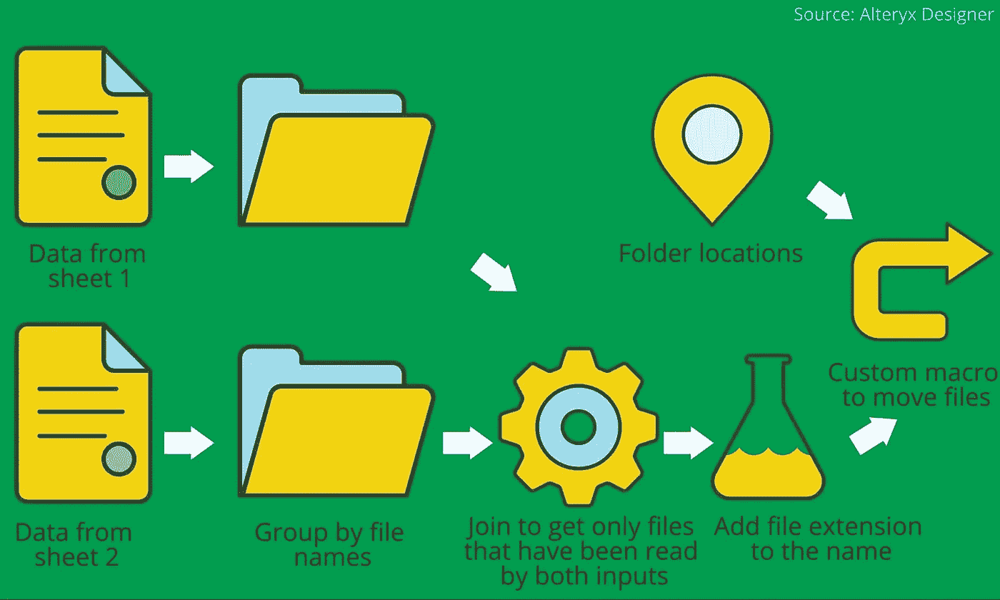

# 为小型企业构建定制 BI 工具的挑战

> 原文：<https://medium.com/swlh/challenges-of-building-custom-bi-tool-for-small-business-62dc54c95a64>

Originally published at [freshcodeit.com](https://freshcodeit.com/freshcode-post/challenges-of-building-custom-bi-tool-for-small-business).

对于希望在数据驱动的世界中取得成功的各种规模的企业来说，强大的 BI 工具的必要性变得显而易见。为什么小公司关注经济高效的商业智能软件？首先，他们希望赶上更现代化的竞争对手，并应对不断增长的非标准化数据量。其次，允许查看、报告、比较、分析和讨论信息的技术解决方案对企业家来说变得更加经济实惠。

# 面向小型企业的定制 BI 工具的细节

事实上，大多数投资长期 BI 分析的组织都是小型企业。2018 年，[少于 100 名员工的公司](https://www.forbes.com/sites/louiscolumbus/2018/06/08/the-state-of-business-intelligence-2018/#5040ddc87828)对数据挖掘、存储和处理最感兴趣。这意味着自助式数据分析运动正在不断发展。这些解决方案为企业主带来了许多好处，同时也给 BI 软件开发人员带来了一系列挑战。

Dresner 咨询服务公司的创始人兼首席研究官 Howard Dresner 提到，自 2016 年以来，[小企业在 BI 解决方案领域处于领先地位](http://www.marketwired.com/press-release/dresner-advisory-services-publishes-2016-small-mid-sized-enterprise-business-intelligence-2158742.htm)。他们中的许多人面临着购买大众市场软件或投资构建定制产品的困境。第二种选择适合正在积极发展或对商业智能平台有特定需求的企业。有效的 BI 工具必须满足几个基本的企业报告要求。

1.  带有正确可视化工具的用户友好界面。建立自定义报告和使用仪表板的可能性。
2.  完全可访问的软件，具有一定程度的灵活性，可提供重要的见解和可操作的指标。
3.  从不同来源收集、统一和标准化信息，以提供全面的分析解决方案。

# 项目介绍

Freshcode 的客户旨在获得一个能够快速聚合、过滤和可视化大量数据的系统。他在电影业工作。因此，我们的团队以演员和电影数据库为例。实际上，这个 BI 产品可以用来管理任何数据，而不依赖于主题。该项目的实现分为两个主要部分:
1 .数据摄取
2。数据可视化

谈到技术栈，Java 和 AngularJS 被用来开发这个软件报表工具。该团队转向基于流程的反应式编程。可视化包括分面分类。

# 构建商业智能工具的技术方面

大多数企业声称，跨多个数据源接收易读的可视信息是他们的主要困难。将详细信息存储在各种 CRM、数据库和电子表格中，您需要获得可信且可理解的数据。在这篇文章中，我们将告诉如何克服商业分析工具开发的障碍。

# 商业智能软件的数据整形

下面的流程图显示了这个 BI 报告应用程序的示意结构。正是 ETL 过程看起来像基于流程的编程。我们有几个数据源，转换它们，并使用关节来可视化结构化数据或下载所需格式的文件。

这也是反应式编程的方法，因为每个节点都有自己的“输入”和“输出”。

# 使用多种来源的数据进行有效的业务分析

由于不同关系数据库的连接器，应用程序可以处理几种类型的“输入”:Postgres、MySQL、SQL Server、OracleDB 以及面向文档的(MongoDB)。它还可以处理 CSV、JSON、XML 和 XLS(X)文件。软件支持从数据提供者和无模式数据源派生模式。

很明显，将数据从“输入”直接放入内存是不可能的。因此，我们实现了使用恒定内存大小的基于迭代器的方法。这有助于避免移动内存中的大文件。JSON lines 被用作中间格式。我们在这个商业智能系统中加入了不同的数据转换算法。它们包括联接(块嵌套循环/排序合并/散列联接)、联合和计算列。

# 报告工具中输出的数据存储

最初，我们使用 ElasticSearch 作为数据存储和查询引擎。该客户已经在他以前的项目中使用过 ES，并且喜欢刻面和全文搜索的概念。不幸的是，ES 有一些缺点。尽管查询中小型数据源的速度非常快，但它会随着数据源的大小成比例地增长。对于大型数据源，它会超过几秒钟。索引大型文件也需要相当长的时间。因此，经过对 DBs 和 SQL-on-Hadoop 解决方案的深入研究和比较，BigQuery 被用作简单易用、快速有效的仓库。ES 仍然用于小于特定阈值的文件，在这种情况下，它显示出较低的延迟。导入来自任意大小的 CSV/JSON 文件。

由于 BigQuery 的集成，所有的查询逻辑都转移到了后端。对于 ES 和 BigQuery，实现了查询适配器。由于 ES 查询的复杂性和缺乏语言灵活性，用 Java 为 ES 创建一个新的适配器具有挑战性，因此我们用 Clojure 实现了它。我们还为各个列添加了类似 SQL 的文本表示和全文搜索设置，包括列标记化器(NGram，Edge NGram)。

# 关于 BI 系统中的可视化

有几种可能的观想类型:

*   目录
*   桌子
*   图表
*   地图

用户能够选择服务器端标记集群化，以及基于国家/地区的热图。该表执行 3 个选项:原始数据，树形视图，多级透视。数据在许多级别上按列和行进行了分组。嵌套视图或树视图允许按时间间隔、向下钻取和唯一计数进行分组。透视视图执行了一个[深度度量排序](https://www.elastic.co/guide/en/elasticsearch/guide/master/_sorting_based_on_deep_metrics.html)。

ES 只允许按单值存储桶进行深度排序。它被修改以满足客户对深度排序和精确基数的需求。

起初，我们将 UI 网格用作数据网格。然后迁移到 agGrid 以优化绘制表格的速度。此外，排序、分组和旋转操作被转移到服务器。为了进一步提高性能，agGrid 实现被重写为自定义的基于 Canvas 的解决方案。

由于 ElasticSearch 呈现了数据的分面分类，我们使用分面搜索来构建商业智能报告工具。该方法结合了分面导航系统和传统的搜索技术。使用多个过滤器的机会使得这种类型的搜索在大众市场上非常流行。例如，你可以在众多的网上商店和目录，零售商和图书馆看到它。

为每列创建了一个筛选器。这些过滤器中的每一个都有来自该列的前 10 个唯一值，以及复选框和计数。该系统提供了按值搜索的可能性。用户也可以选择过滤器的组合(和/或)。

[开发](https://freshcodeit.com/services/web-development)定制 BI 报告工具的复杂过程需要认真的规划和对最终产品的清晰愿景。如果你需要一个系统来更好地收集和汇总外部来源的相关数据，把你的想法写在纸上。这将帮助你避免误解和其他困难。所有功能都应该详细描述，以及对程序技术部分的要求。如果你需要技术咨询或任何类型的网络服务，你可以申请[经验丰富的程序员](https://freshcodeit.com/)的帮助。

*原创文章* [*打造定制商务智能工具的挑战*](https://freshcodeit.com/freshcode-post/challenges-of-building-custom-bi-tool-for-small-business) *发表于*[*【freshcodeit.com】*](https://freshcodeit.com)*。*

## 这篇文章发表在 [The Startup](https://medium.com/swlh) 上，这是 Medium 最大的创业刊物，有+423，678 人关注。

## 订阅接收[我们的头条](https://growthsupply.com/the-startup-newsletter/)。

