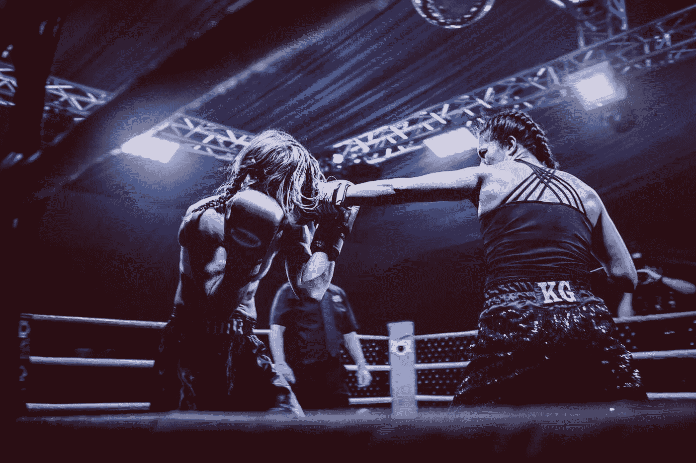

# 冠军焦点在 30 秒内

> 原文：<https://medium.com/swlh/champion-focus-in-30-seconds-3201afdc10f7>

## 如何逃离注意力分散的陷阱，训练你的思维流动

[Bella Jones](https://instagram.com/bellaboxer_strongmums_pt) (right) boxing Claire Edwards in 2017\. Fun fact: Bella and I fought each other for a British title in 2010\. To this day, it remains my favourite bout. Unfortunately, the photos aren’t as good as this one. Image credit: [Sam Riley](https://samrileyphotography.com).

去年夏天一个炎热的星期二晚上，我靠在拳击场的绳索上，看两个人拳击。有些不对劲。我已经教了他们两个很多年了，所以我很了解这些拳手。通常情况下，他们的回合充满了经典的角度，精确的准确性和快速的反应。但是在这一天，他们…