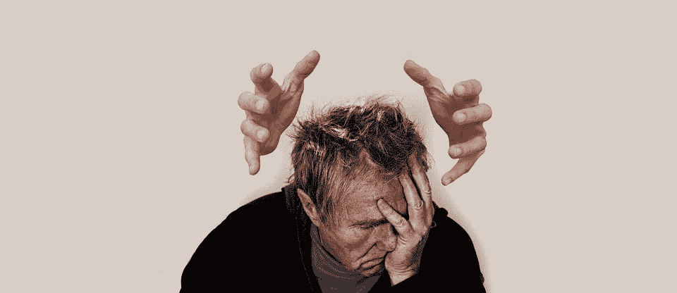

# 人格刺客

> 原文：<https://medium.com/swlh/character-assassins-e6ca2d110072>

## 他们是谁，他们如何破坏

[CC0 / Max Pixel](https://www.maxpixel.net/Arrows-Stress-Burnout-Bullying-Shame-Face-Man-3721062)

> "最好的报复就是不要像伤害他的人那样."
> ~ **马可·奥勒留，沉思录**

M 我接触的所有客户都有各种形式的情感和心理虐待史，包括童年欺凌、家庭替罪羊、被反社会的配偶操纵和侮辱，或者被当成“坏人”…