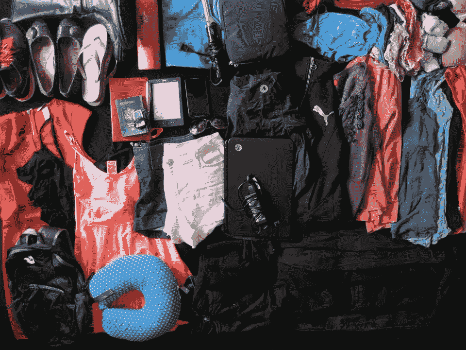

# 检查你的极简主义自我(我也会这样做)

> 原文：<https://medium.com/swlh/check-your-minimalist-ego-and-i-will-too-ae79e1ce9924>

当我卖掉十年来积累的所有财产时，感觉真好。扔掉那些垃圾，我可以自由地背起 35 升的背包环游世界。

我们这些背包客会围坐在旅馆的桌子旁，宣布我们有意摆脱物质上的束缚。但是在很短的时间内，我注意到了一些事情。典型的对话可能是这样的。。。