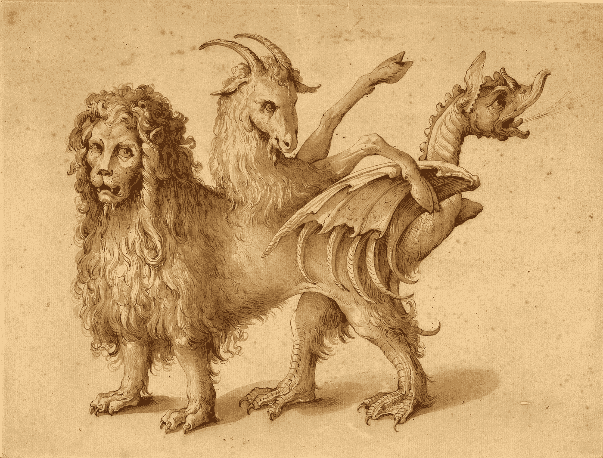

# VC 动物寓言集的新成员

> 原文：<https://medium.com/swlh/chimera-a-new-addition-to-the-vc-bestiary-954ecf553551>

## 独角兽对战龙

## *嵌合体:是什么将最好的风投与其他风投区分开来*

[Chimera](https://en.wiktionary.org/wiki/chimera#/media/File:Ligozzi_(Una_quimera).jpg), the fire-breathing three-animal monster from Homer’s Iliad and the newest member of the VC Bestiary

近年来，媒体和风投界已经抓住了独角兽的概念，即估值在 10 亿美元或以上的初创企业。尽管独角兽仍然很少见，但它正变得越来越普遍。根据 [CB](https://www.cbinsights.com/research-unicorn-companies) …