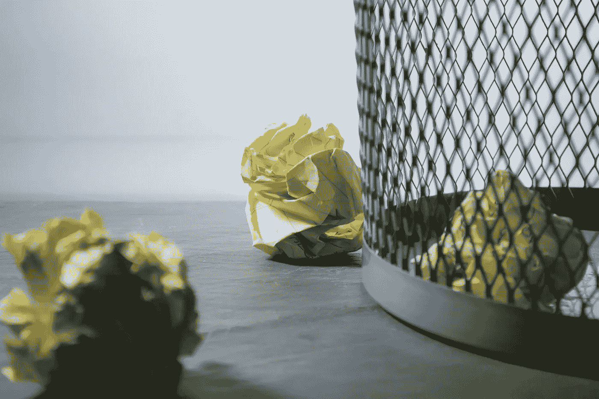

# 选择你的优先事项，无情地消除其余的

> 原文：<https://medium.com/swlh/choose-your-priorities-and-ruthlessly-eliminate-the-rest-37d48f5a8b2>

Originally published on [**JOTFORM.COM**](https://www.jotform.com/blog/life-changing-priorities/)

最近，我站在衣柜里考虑一件旧的体育馆 t 恤是否能给我带来快乐。

我采纳了组织专家玛丽·近藤(Marie Kondo)的建议，她的畅销书《改变生活的整理魔法》风靡全球。

根据近藤的说法，我们可以整理我们的家，我们的生活，通过决定我们的每一件财产是否会产生火花…