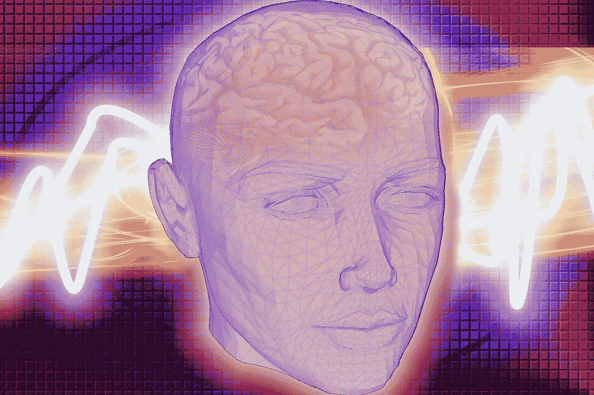

# 阿尔茨海默病患者的情感脑机接口

> 原文：<https://medium.com/swlh/classical-conditioning-brain-state-classification-affective-bcis-for-ad-patients-8478cd271ef0>

Image credit: Kai Kalhh

## 用脑机接口检测情绪状态。

脑机接口是测量大脑信号，然后从信号中提取特征并将其转换为输出信号的系统。对于患有损害肌肉或控制肌肉的神经通路的疾病的患者来说，脑机接口可能有令人难以置信的前景。