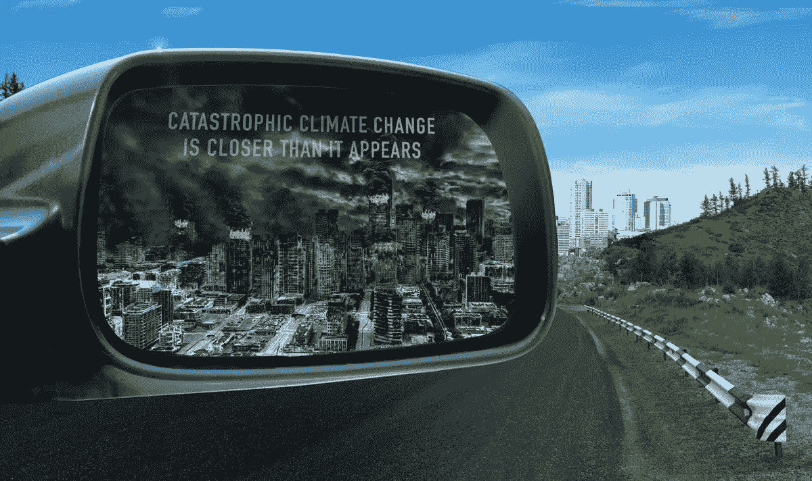

# 气候变化:渐进主义不再是一个可行的选择

> 原文：<https://medium.com/swlh/climate-change-incrementalism-is-no-longer-a-viable-option-34bb9b0a2d82>

## 企业可以被引向一个更可持续的星球——但我们需要勇敢。

PHOTO ILLUSTRATION BY BRYAN GEE (SOURCE: GETTY IMAGES)

气候正在我们眼前瓦解。前所未有的高温、洪水、融化和干旱只是冰山一角，然而我们的物种似乎无法找到防止混乱和可能…