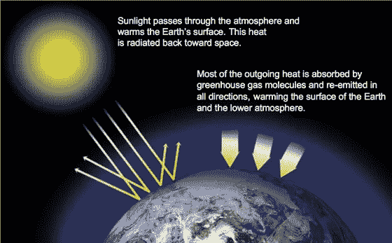
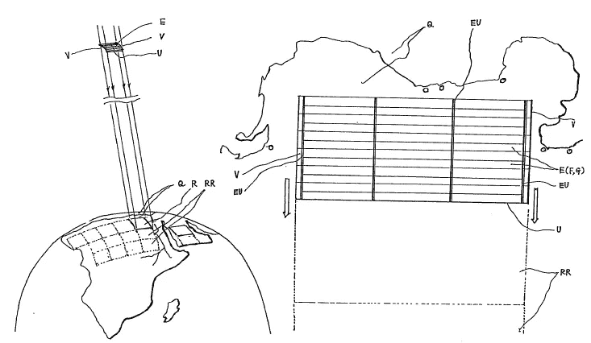
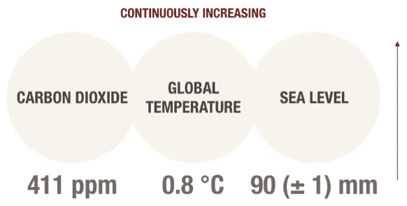
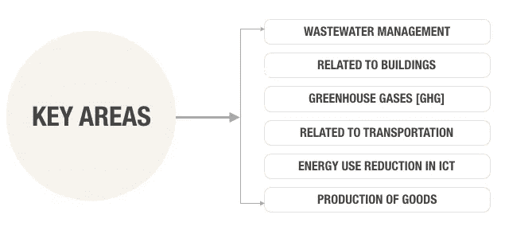
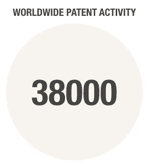
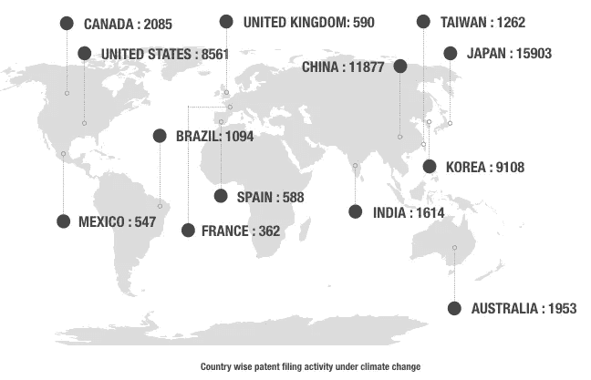
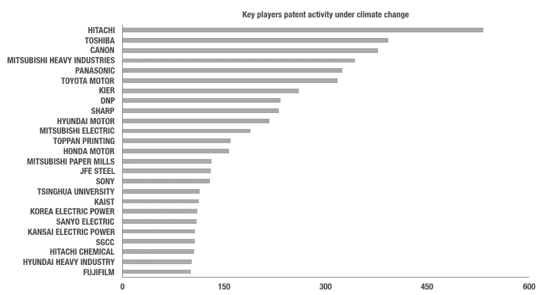
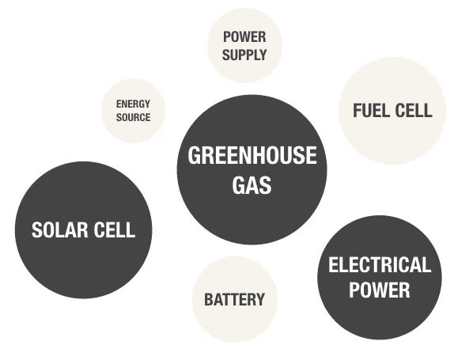

# 气候变化是真实的！

> 原文：<https://medium.com/swlh/climate-change-is-real-62d63a90219b>

## 在地球上，人类活动正在改变自然温室。

Source: NASA

> **气候系统变暖的科学证据是明确的。**
> 
> **——政府间气候变化专门委员会**

1990 年 3 月 5 日，一位名叫[中川武夫](https://patents.google.com/?inventor=Takeo+Nakagawa&sort=old)的日本发明家在人造卫星下申请了一项[发明](https://worldwide.espacenet.com/publicationDetails/biblio?CC=WO&NR=9010378A1&KC=A1&FT=D)。

本发明涉及一种面向地球的装置，即太空中的人造卫星，将太阳光线阴影部分投射到地球的特定区域，控制天气并通过太阳光线发电人工地和局部地产生自然，并保护地球环境。

Diagram in the WIPO patent application WO1990010378A1

日本发明人陈述了地球环境的问题，例如地球变暖、臭氧层破坏、酸雨、森林退化、荒漠化、食物问题等，这些问题由于本世纪世界人口急剧增加导致化石燃料消耗急剧增加而变得日益严重。

他预测，如果这些问题得不到纠正，将在 21 世纪及其后变得更加严重和全球化。

我们正处于 21 世纪，全球气温上升和气候变化的影响是巨大的，并且变得非常关键。

> [《联合国气候变化框架公约》](https://unfccc.int/news/unfccc-25th-anniversary-climate-action-is-more-urgent-than-ever) (UNFCCC)最近庆祝了 25 周年，联合国气候变化执行秘书帕特里夏·埃斯皮诺萨(Patricia Espinosa)表示，
> 
> “虽然我们在 25 年里取得了巨大的进步，但世界仍然落后于气候变化。今天，应对气候变化的紧迫性从未像现在这样强烈。但是，由于这项工作始于 25 年前，我们也能更好地协调开展这项工作。我们有巴黎协定，我们有加强该协定的指导方针。我们现在需要的是结果。”

美国宇航局监测气候变化，并向公众和科学界提供数据，相信这些数据的广泛传播将导致更多的理解和新的科学见解。

自 19 世纪后期以来，地球的平均表面温度上升了约 1.62 华氏度(0.9 摄氏度)，这一变化主要是由二氧化碳和其他人为排放到大气中的气体增加引起的。大多数变暖发生在过去的 35 年里，有记录以来最热的五年发生在 2010 年。

美国宇航局重力恢复和气候实验的数据显示，1993 年至 2016 年间，格陵兰岛平均每年损失 2860 亿吨冰，而同期南极洲每年损失约 1270 亿吨冰。在过去的十年里，南极洲的冰量减少了两倍。

> 在上个世纪，煤和石油等化石燃料的燃烧增加了大气中二氧化碳(CO2)的浓度。

20 世纪目睹了全球范围内世界人口的膨胀和人类活动的增加。全球环境恶化的趋势预计将在不久的将来导致越来越严重的危机局势。

> 是的，气候变化是真实的，但全球研究界和政府机构应对气候变化的努力也是真实的。

Top contributors to climate change

造成气候变化和全球变暖的一些主要因素是水资源管理、温室气体、运输和商品生产。

世界范围内的研究和创新团体正专注于这些领域，以提供技术和应用来有效地处理每个顶级贡献者。

Patent data set studied under climate change

在气候变化下观察到大量活跃的研究活动。具体来说，在全球变暖的背景下，我们研究了在全球范围内申请的 38000 项专利。高研究活动提供了一个鼓励，以发展大规模的技术，以处理气候变化问题，我们的星球正面临着。

1990 年，日本发明家中川武夫建议使用人造卫星来控制气候变化。这一趋势仍在继续，在日本观察到气候变化方面的大量研究活动。

**如果要在减缓气候变化方面成为全球领导者，那么在研究和提供应对气候变化的技术进步方面，日本无疑处于领先地位。**

中国、韩国和美国等其他国家正在推动气候变化方面的研究活动。

根据 38000 项专利数据，日本公司正在成为减缓气候变化的领导者。日立、东芝、佳能、三菱、本田和丰田等日本公司正在减少 GHG 排放量。

现代公司和韩国电力公司等韩国公司也在应对气候变化及其影响方面开展了引人注目的研究活动。

中国的主要大学之一清华大学正在与全球大学合作应对气候变化问题。

韩国大学 KAIST 正在研究代谢工程等领域，以解决气候变化问题**。**

**Key research areas under climate change**

气候变化下的 38000 项专利数据揭示了温室气体排放是全球公司和大学的首要关注领域。

太阳能、燃料电池、电力和电池等领域也有研究活动。

近年来专利申请活动的大幅增加显示出应对气候变化问题的良好迹象。

从 2001 年到 2015 年，专利活动增加了 200%。2011 年至 2015 年间，全球研究界共申请了 13950 项专利。

> **研究活动的增加表明，在未来几年，随着缓解气候变化和全球变暖的技术进步，基础设施将会发生变化。**

更多关于气候变化的报道。在接下来的几周里，我会发表更多关于气候变化的文章。

专利和研究活动提供了非常有价值的信息，为我们面临的一些大问题找到了经济可行的解决方案。

如果你想合作或有任何疑问或建议，请联系 contact@incubig.com。

您还可以创建您的 Incubig 帐户，并利用根据您的要求定制的高度可信的研究和商业见解。【https://www.incubig.com/login 号

不断创新！

谢谢你。

## 这篇文章发表在[《创业](https://medium.com/swlh)》上，这是 Medium 最大的创业刊物，有+444678 人关注。

## 在这里订阅接收[我们的头条新闻](https://growthsupply.com/the-startup-newsletter/)。

