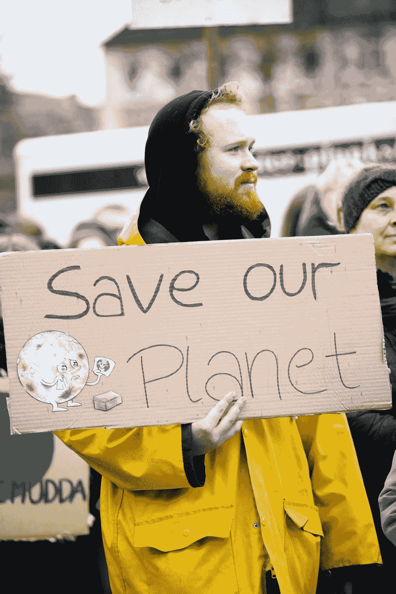
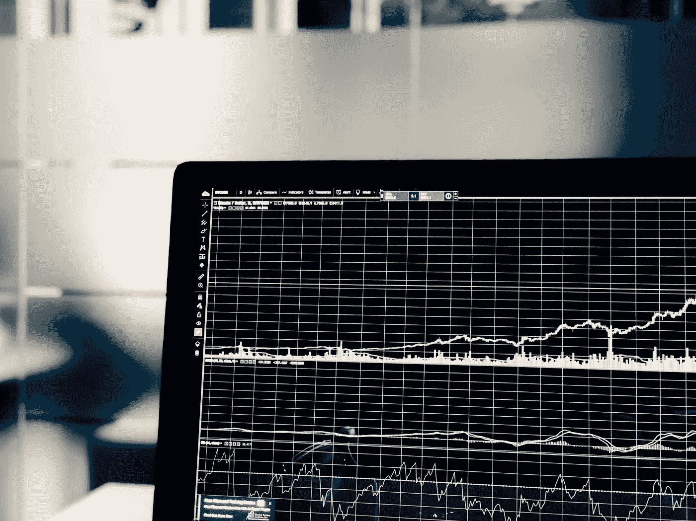
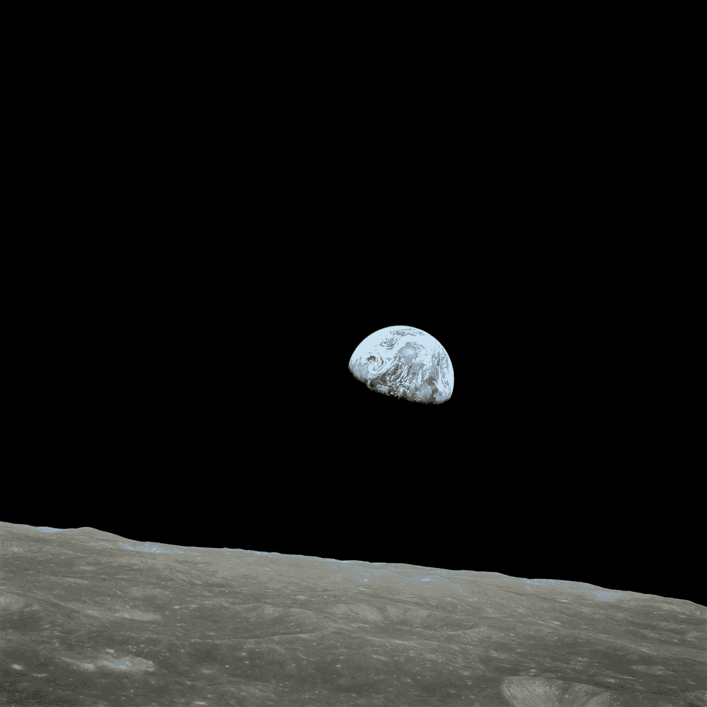

# 气候变化:恐吓战术对反动政治意味着我们都输了

> 原文：<https://medium.com/swlh/climate-change-scare-tactics-vs-reactionary-politics-means-we-all-lose-7edf5601e732>

Photo by [Markus Spiske](https://unsplash.com/@markusspiske?utm_source=unsplash&utm_medium=referral&utm_content=creditCopyText) on [Unsplash](https://unsplash.com/collections/4995550/climate-change?utm_source=unsplash&utm_medium=referral&utm_content=creditCopyText)

**政治烂**

我们的媒体和政治家处理复杂社会挑战的方式令人恼火。

第一步:将主题分解成简单的片段，这些片段违背了事实，但却激怒了人们。

第二步:妖魔化任何持反对观点的人。

第三步:创建文件和分析，用看似强有力的凭证排列证人，以支持首选的观点。

第四步:让好莱坞明星担任这项事业的代言人。

第五步:公开哀叹无力采取行动——政治照常，特殊利益集团利用大资金来挫败真正的行动(总是其他人有大资金)等等。

第五步:把它写进下一个选举周期的广告活动中。"我们很努力了，但是其他人又坏又蠢。"。

第六步:完成！

但实际上什么也没做——除了在目标选民中得分和为选举募集更多的钱。

我们似乎无法在任何重要问题上取得进展。

**关于全球气候变化的争论是我们的系统出了什么问题的最好例子。**

媒体对气候变化辩论的报道缺乏信息。正如预期的那样，媒体将此描述为以下两者之间的斗争:1)那些支持 95%的科学界人士的人，他们预测牲畜放屁、煤电厂和汽油驱动的车辆将融化极地冰盖，吞噬几个岛国，并在未来 5 年内毁灭文明；2)那些“气候否认者”，他们显然是无知的反科学右翼分子，他们相信地球是平的，在他们的后院有一个末日避难所。

具有讽刺意味的是，最大声的点名者实际上是非科学家，他们在与这个问题相关的无数学科中没有受过实际教育。如果我们要使用统计学——我敢打赌 ***至少*** 95%的电影明星、政治家、脱口秀主持人和记者在骂人的时候几乎没有接受过真正的科学教育，也没有掌握科学方法。

**媒体应该谈论什么？**

至少，我们应该了解以下内容:

1)什么是真正的全球气候变化？

2)我们有什么证据让我们了解它在过去有多重要？

3)是什么导致了气候变化，我们能否准确预测这种影响？

4)人类对气候变化的影响有多大？

5)可以做些什么来限制人类的影响，这些行动会带来哪些附带的社会影响和好处？

气候变化发生的证据是铁一般的。这种情况在过去发生过，世界许多地方都发生了巨大的变化，这种情况在未来也会发生。更难的部分是理解导致气候变化的力量，这些力量如何结合起来产生变暖或变冷，我们在那个循环中的位置，以及我们对气候变化的贡献有多重要。

不要屏住呼吸等待 MSNBC 或福克斯以客观的方式处理这些问题。

**我不知道所有的答案，但我想没有人知道**

问汽车修理工为什么你的车不动是一回事。问“科学家”气候变化预测有多准确完全是另一回事。这个问题很复杂。气候变化可能是国家舞台上最复杂的问题之一。它涉及到如此多的学科，以至于没有一个专业能够处理所涉及的一系列因素。

化学家懂化学，物理学家懂物理，天文学家懂天文学，等等。此外，在这些领域中，每个人都有专长。不要让粒子物理学家来权衡天体动力学。他没有花费他的职业生涯来研究数据，建立模型，设计太空任务轨道，并成功地将航天器发送到火星。他很可能不知道对数螺线的霍曼转移。

底线是“气候科学家”在学校里不会学到**与这个话题密切相关的所有东西。说许多“科学家”相信某事对我来说不是很深刻。我更感兴趣的是科学家为什么会想一些东西，而不是他们是怎么想的。**

我自己的教育和经历让我洞察到影响每个人解决这个问题的难题之一——建模。

**我怎么想？**

我提倡采取行动改变我们的生活和工作方式，以解决一系列环境问题。

我认为人类有可能影响气候周期。然而，我不相信来自气候科学界的预测。

在你说我坏、笨、笨、腐败之前，请听我说……让我们不要相信我们的媒体和政治家的虚假二元论。

**科学家如何预测未来事件？**

Photo by [Chris Liverani](https://unsplash.com/@chrisliverani?utm_source=unsplash&utm_medium=referral&utm_content=creditCopyText) on [Unsplash](https://unsplash.com/search/photos/fortune-teller?utm_source=unsplash&utm_medium=referral&utm_content=creditCopyText)

> "很难做出预测，尤其是对未来的预测。"
> 
> ― **约吉贝拉**

科学家使用计算机模型来预测未来。这些模型有严重的局限性。模型只是现实的近似值——它们不是告诉我们未来会发生什么的可靠预言。

几十年前我和一个朋友进行了一次讨论，让我意识到很多人并不理解模型。她在某处读到过，美国国家航空航天局运行了我们太阳系运动的计算机模型，并回顾了几千年后发现，有一天太阳确实如圣经所声称的那样静止不动。

我被这吓得沉默不语。康复后，我向她解释说，模特不是那样工作的。太阳系的天体动力学模型可以让我们相当合理地了解几千年前在一年中的任何给定时间每颗行星的位置——除非发生了模型中没有的事情。).

这些模型肯定不会预测运动方程和正在使用的引力模型之外的事件——比如天堂伸出手来阻止地球绕太阳运行。).

像太阳耀斑、构造运动、大气变化这样的事情不是随机的。一些事件或条件的顺序导致了它们。然而，我们通常不知道事件的确切顺序。我们通常可以确定起作用的主导因素，然后我们发展这些影响之间的数学关系。我们使用方法学来拟合这些变量的方程，并“调整”模型，以便它们预测我们知道在过去发生的事情。

然而，预测过去事件的模型可能不太擅长预测未来事件。其中一个原因是，这个等式实际上可能比我们意识到的更复杂。还有，可能有我们没有考虑到的因素。请将此视为模型本身的不确定性。

Photo by [Chris Liverani](https://unsplash.com/@chrisliverani?utm_source=unsplash&utm_medium=referral&utm_content=creditCopyText) on [Unsplash](https://unsplash.com/search/photos/stock-chart?utm_source=unsplash&utm_medium=referral&utm_content=creditCopyText)

也可能是模型中某些变量或条件的估计不正确。把这想象成数据中的不确定性。

还要注意，不确定性分布被分配给变量，并且不确定性必须通过计算来传播。变量的不确定性越大，答案的不确定性就越大。

问问你自己，你认为一百多年来收集的全球气温数据的准确性有多一致。然后看看预测的精确度。

日内交易者每天都在努力克服这些影响。这些金融数学家使用令人眼花缭乱的图表和指标，试图预测下周股市的走势。但不乏天才的金融预言家会犯错误。

在艾萨克·阿西莫夫著名的“基础”系列中，数学家哈里·谢顿发展了心理史学。由于在他的宇宙中有 750-800 亿人活着，他能够用数学预测人类的行为(故事是这么说的)。即使在艾萨克·阿西莫夫的虚构世界里，由于引入了一个方程中没有的计划外因素，该理论最终也失败了。

这里的关键是，一个好的预测模型在很大程度上依赖于定义所有的变量，获得正确的相关性和建模交互，并适当地包括不确定性。在复杂的模型中，小的误差会变成大的误差。

不要篡改数据！

我最喜欢的一位老师，我的博士委员会主席，曾经半开玩笑地对我说，“除了上帝，没人能篡改数据”。他非常重视数据的完整性。在严肃的分析中，编辑、排除、偏向和其他操纵数据的技巧是不允许的。我已经在许多地方看到了这些应用，很明显，NOAA 和其他参与气候预测的人“调整”了数据——原因我相信他们会觉得很有说服力。这是不对的。

**信仰的作用**

> *“信心是希望之物”*
> 
> *――希伯来书 11:1*

这是人类的天性，发展一种世界观，并通过这种视角解释事件和发生的事情。当人们不诚实时，你会感觉到事情是如何运作的。我们经常从这个角度来解释事实和数据。甚至科学家和工程师也这么做。

太多时候，我们对事物现状的信念(我们的信仰)导致我们在看似相反的证据面前不妥协。

我的一个朋友有一个关于气候变化的雅虎讨论组。我并不总是同意他的观点，但他发表了一些我认为正确的观点。

> “你必须始终愿意真正考虑与你的信念相矛盾的证据，并承认你可能是错的。智慧不是无所不知，而是挑战一切的能力。”
> 
> -觉悟

我们需要愿意改变我们的想法。事实和数据是科学的指路明灯。当他们把我们引向一个意想不到的方向时，跟着痕迹走，看看它通向哪里。

许多被阿尔·戈尔这样的人物奉为真理的东西，充其量被证明是站不住脚的。对一些人来说，认识到二氧化碳实际上可能在变暖中没有主要作用是一个难以下咽的药丸。水下火山活动可能是南极洲冰川融化的原因，这一发现给他们的相处带来了麻烦。

随着新信息的出现，科学也在发生变化，这是理所应当的。

这给我们带来了什么？

我们无法准确预测像全球气候循环这样的灾难性事件，这一事实应该让我们感到担忧。变暖和变冷趋势的影响可能是巨大的，即使时间范围很长。一个冰冻周期可能会使北美、北欧和亚洲的大部分地区回到冰河时代。变暖循环真的会淹没海平面城市，重塑我们世界的海岸线。不管有没有人的干预，这些循环都是不可避免的。

5 年后会这样吗？似乎不太可能。然而，无论是 5 年还是 50 年，在生命、幸福和财富方面的代价将是巨大的。我们需要理解这一现象，并采取谨慎行动，开始建设能够承受这些挑战的基础设施、城市和文明。

如果人类对地球生态系统的影响会增加气候循环的频率或严重性，那我们就更应该担心了。虽然我不认为科学有办法在短期内准确量化这些影响，但我们面临的巨大风险要求我们采取行动。

等待一个完美的模式(或等待政治家精心制定一个可靠的计划)的问题是，当我们到达那里时，采取行动已经太晚了。

> “任何傻瓜都能看出危机何时到来。对国家的真正服务是在胚胎中发现它。”
> ― **艾萨克·阿西莫夫，** [**基础**](https://www.goodreads.com/work/quotes/1783981)

我也认为这是一个道德问题。

Earth Rise, Taken By astronaut Bill Anders

不管一个人的宗教或精神信仰如何，我们大多数人都会同意，这个世界是无生命的海洋中的一颗罕见的宝石。1968 年的圣诞节，宇航员比尔·安德斯拍了一张地球从月球表面升起的照片，这深刻地提醒了我们这个事实。客观地说，我们理解我们周围空虚的巨大轨迹。但是看到浩瀚宇宙中那小小的蓝色生命之池会让你的灵魂充满惊奇。让我们保护我们所拥有的。

在以前的时代，人类认为地球是为了我们的开发而存在的。人们无法想象人类有能力毁灭我们的世界。地球是一种无限的资源。绝大多数人对科学知之甚少甚至一无所知，他们的视野必然局限于第二天为家人提供食物。今天，世界大部分地区都不在这个位置上。我们的视野必须远大于明天。我们有责任为子孙后代维护我们赖以生存的这个脆弱的航天器。

今天，我们知道我们真的可以终结地球上的所有生命。这是一个令人不寒而栗的可能性。有了核武器，这当然是可能的。但也有可能我们在繁忙的生活中，通过工业、交通运输和人类从事的所有其他活动，对地球造成了无法修复的破坏。我们可以争论方法和手段，但这是可能的。

让我们做我们知道应该做的事情

我们的世界已经充满了死亡地带、放射性废物池、海洋中塑料的大量聚集、牲畜相关污染物的有毒聚集等等。全球各地的发电厂和制造厂每天都会产生大量的毒素。在一些地区，人们在日常生活中不得不戴口罩。可能是一百年，也可能是一万年，但最终我们会让这个世界变得无法居住，除非我们改变自己的行为。

我们需要避免走得太快，因为这样会适得其反。人们真的必须要有饭吃，有家住，有路去上班和上学。如果在不确定的环境影响和饥饿的孩子之间做出选择，他们会选择后者。在我看来，的确如此。

如果我们对人们的生活造成足够大的干扰，他们就会转而反对环保措施。我们只是不知道足够的理由进行全国动员。我们需要合理和稳步的进展。大事可以从小事开始。

也许我们应该从坚持在这个问题上进行公开合理的对话开始，而不是通常的政治斗争。