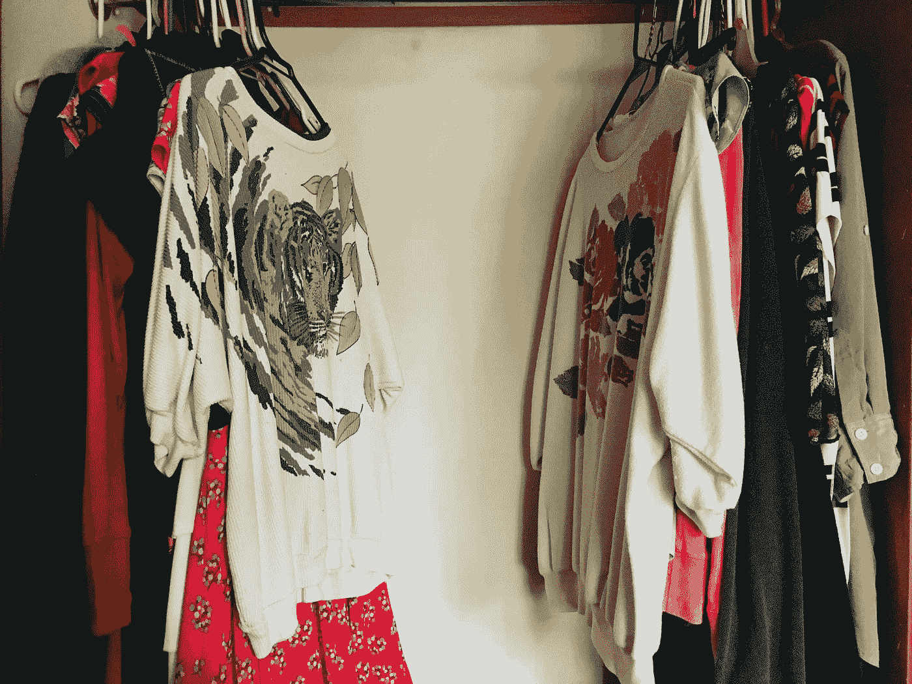

# 关于我的衣服这个充满情感的话题

> 原文：<https://medium.com/swlh/clothes-accbc3c90d91>

An actual picture of my closet, divided between my mom’s two favorite shirts.

小时候，我的很多衣服都是别人穿过的。

教堂里有一个家庭，有两个比我和姐姐大几岁的女孩，所以大约每年都会有一个巨大的垃圾袋，里面装满了稍微过时的衣服，送到我们家。

如果我们的衣服是新的，它们通常来自像沃尔玛或塔吉特百货这样的地方(如果你足够老，你会…