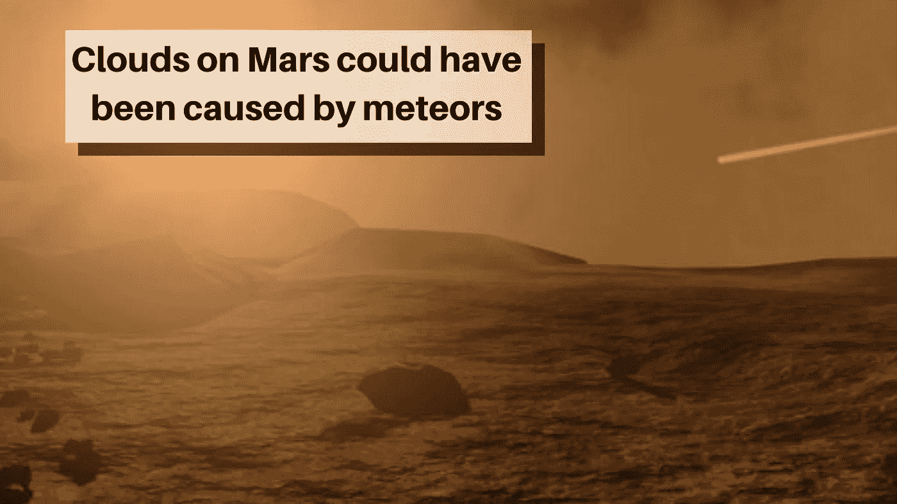

# 火星上的云可能是由流星造成的

> 原文：<https://medium.com/swlh/clouds-on-mars-could-have-been-caused-by-meteors-ee4c74239374>

Mars landscape and atmosphere may not be as isolated as previously believed, new research indicates (ESA)

## 火星的云是怎么来的？新的研究表明，关键成分可能是流星。

科学家和天文学家已经知道火星中层大气中的云，它始于表面上方约 18 英里(30 公里)处，但迄今为止，他们一直难以解释它们是如何形成的。一项新的研究——