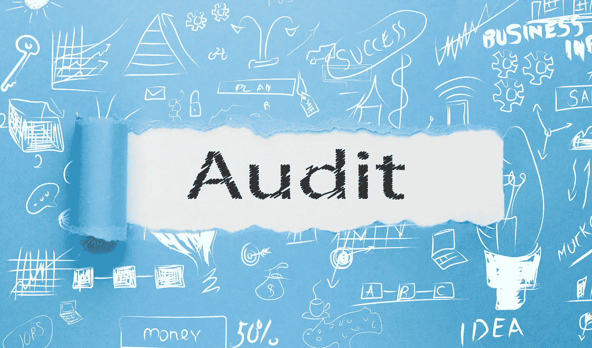

# 代码审计

> 原文：<https://medium.com/swlh/code-audits-an-in-depth-analysis-of-your-systems-health-27292bbeb100>

## 对系统运行状况的深入分析

对于许多项目，客户雇佣我们只运行代码审计。在其他情况下，我们继承遗留代码，并且通过代码审计是与我们一起工作的一个要求。

随着时间的推移和重复的经验，我们完善和战略我们的审计过程。它现在是我们单独提供给客户的一个独特的工作产品。